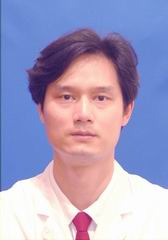

<!-- AUTO-GENERATED-BY: work/generate_obsidian_profiles.py -->

<!-- TEMPLATE: D:\workspace\信息收集整理\医生画像仓库\模板\医生画像模板.md -->

# 刘建平

## 基础信息

| 字段 | 内容 |
|---|---|
| 姓名 | 刘建平 |
| 医院 | 中山大学孙逸仙纪念医院 |
| 科室 | 胆胰外科 |
| 职称/身份 | 主任医师 |
| 来源链接 | [官网原文](https://www.gzsys.org.cn/node/15214) |
| 采集日期 | 2026-08-13 |

## 简介/擅长

## 科研项目与成果

- 并对各种类型的肝脏移植有深入研究，已在国内外各种知名剘刊发表论著100余篇，获得省部级以上科研基金16项。
- 主持的“重组人生长激素在原发性肝癌中应用的实验与临床研究”获广东省科技成果二等奖。

## 论文与学术产出

- 《门静脉高压症理论与实践》主编，《门静脉高压症现代治疗学》副主编。
- 并对各种类型的肝脏移植有深入研究，已在国内外各种知名剘刊发表论著100余篇，获得省部级以上科研基金16项。

## 可包装亮点

- 中山大学孙逸仙纪念医院胆胰外科副主任，博士研究生导师，医学博士，广东省医疗行业协会门静脉高压症管理分会副主任委员，中国医促会胰腺疾病分会委员，广东省健康管理学会肝胆胰专业委员会常委、胰腺病专业委员会常委，广东省肝病学会常委。
- 擅长原发性肝癌，特别是巨大肝癌的手术治疗及综合治疗，并擅长门静脉高压症、胆管癌，胆囊癌，各种复杂的胆管结石，胰腺的良恶性肿瘤、胃肠道肿瘤的精准外科手术。
- 并对各种类型的肝脏移植有深入研究，已在国内外各种知名剘刊发表论著100余篇，获得省部级以上科研基金16项。
- 主持的“重组人生长激素在原发性肝癌中应用的实验与临床研究”获广东省科技成果二等奖。

## 重点疾病/人群标签

- 慢性病：
- 肿瘤：肿瘤、癌、肝癌、复杂
- 生殖疾病：
- 免疫/风湿：
- 术后恢复/康复：
- 疑难重症：肿瘤、癌、肝癌、复杂

## 证据摘录

> 只摘录官网公开信息中的短句或关键字段，不复制大段原文。

- 官网身份字段：主任医师
- 官网亮眼经历线索：中山大学孙逸仙纪念医院胆胰外科副主任，博士研究生导师，医学博士，广东省医疗行业协会门静脉高压症管理分会副主任委员，中国医促会胰腺疾病分会委员，广东省健康管理学会肝胆胰专业委员会常委、胰腺病专业委员会常委，广东省肝病学会常委。 擅长原发性肝癌，特别是巨大肝癌的手术治疗及综合治疗，并擅长门静脉高压症、胆管癌，胆囊癌，各种复杂的胆管结石，胰腺的良恶性肿瘤、胃肠道肿瘤的精准外科手术。 并对各种类型的肝脏移植有深入研究，已在国内外各种知名剘刊发…
- 来源链接：https://www.gzsys.org.cn/node/15214

## BD 画像摘要

刘建平医生可作为肿瘤、疑难重症方向的基础画像候选。后续 BD 使用应继续以官网来源和人工复核为准，不添加疗效承诺或无来源包装。

## 合规边界

- 仅使用医院官网、官方公众号、官方小程序等公开渠道。
- 不采集私人电话、私人微信、家庭住址、患者隐私或非公开排班信息。
- 不写“保证治愈”“疗效第一”“包治疑难杂症”等无法由官网证明的表述。
