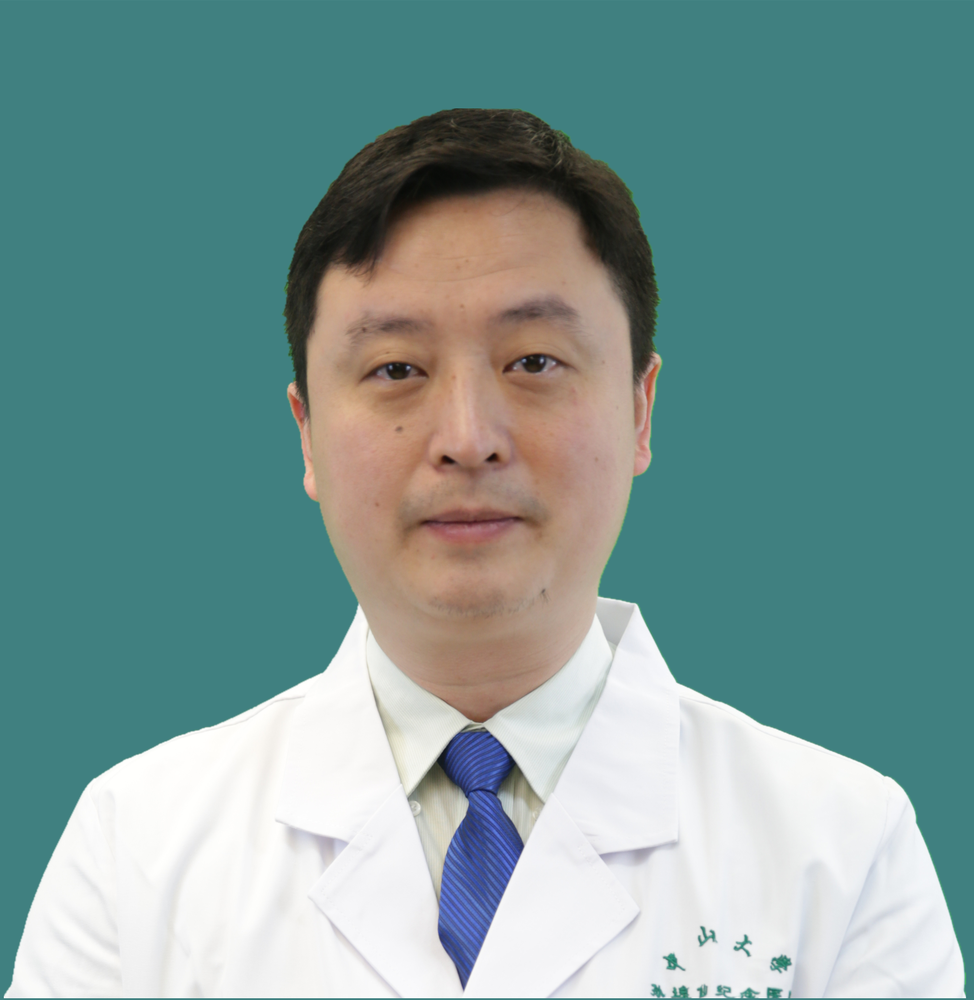

<!-- AUTO-GENERATED-BY: work/generate_obsidian_profiles.py -->

<!-- TEMPLATE: D:\workspace\信息收集整理\医生画像仓库\模板\医生画像模板.md -->

# 刘强

## 基础信息

| 字段 | 内容 |
|---|---|
| 姓名 | 刘强 |
| 医院 | 中山大学孙逸仙纪念医院 |
| 科室 | 乳腺外科 |
| 职称/身份 | 主任医师, 教授, 研究员 |
| 来源链接 | [官网原文](https://www.gzsys.org.cn/node/14896) |
| 采集日期 | 2026-08-13 |

## 简介/擅长

## 教育与进修经历

- 毕业于中南大学湘雅医学院和新加坡国立大学，先后任哈佛大学Dana Farber 癌症中心博士后及讲师，2011年以中山大学 “ 百人计划 ” 引进回国。

## 科研项目与成果

- 长期从事乳腺肿瘤临床及科研工作，对乳腺癌的早期诊断及个体化治疗有较深入的研究，擅长乳腺良恶性疾病的鉴别诊断、乳腺癌的手术和综合治疗，尤其高难度保乳手术和疑难乳腺癌的个体化精准治疗。
- 先后主持多项国家级重大项目包括国自然重点项目和973课题，在国际期刊上发表七十多篇SCI论文，并多次应邀在国际学术会议上做大会演讲。

## 论文与学术产出

- 先后主持多项国家级重大项目包括国自然重点项目和973课题，在国际期刊上发表七十多篇SCI论文，并多次应邀在国际学术会议上做大会演讲。

## 可包装亮点

- 外科主任；
- 乳腺外科主任；
- 教授/主任医师/研究员；
- 长期从事乳腺肿瘤临床及科研工作，对乳腺癌的早期诊断及个体化治疗有较深入的研究，擅长乳腺良恶性疾病的鉴别诊断、乳腺癌的手术和综合治疗，尤其高难度保乳手术和疑难乳腺癌的个体化精准治疗。

## 重点疾病/人群标签

- 慢性病：
- 肿瘤：肿瘤、癌、乳腺癌、免疫、疑难
- 生殖疾病：
- 免疫/风湿：肿瘤、癌、乳腺癌、免疫、疑难
- 术后恢复/康复：
- 疑难重症：肿瘤、癌、乳腺癌、免疫、疑难

## 证据摘录

> 只摘录官网公开信息中的短句或关键字段，不复制大段原文。

- 官网身份字段：主任医师, 教授, 研究员
- 官网亮眼经历线索：外科主任； 乳腺外科主任； 教授/主任医师/研究员； 长期从事乳腺肿瘤临床及科研工作，对乳腺癌的早期诊断及个体化治疗有较深入的研究，擅长乳腺良恶性疾病的鉴别诊断、乳腺癌的手术和综合治疗，尤其高难度保乳手术和疑难乳腺癌的个体化精准治疗。
- 来源链接：https://www.gzsys.org.cn/node/14896

## BD 画像摘要

刘强医生可作为肿瘤、免疫/风湿/感染、疑难重症方向的基础画像候选。后续 BD 使用应继续以官网来源和人工复核为准，不添加疗效承诺或无来源包装。

## 合规边界

- 仅使用医院官网、官方公众号、官方小程序等公开渠道。
- 不采集私人电话、私人微信、家庭住址、患者隐私或非公开排班信息。
- 不写“保证治愈”“疗效第一”“包治疑难杂症”等无法由官网证明的表述。
