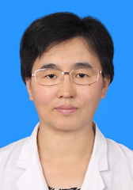

<!-- AUTO-GENERATED-BY: work/generate_obsidian_profiles.py -->

<!-- TEMPLATE: D:\workspace\信息收集整理\医生画像仓库\模板\医生画像模板.md -->

# 刘玉昆

## 基础信息

| 字段 | 内容 |
|---|---|
| 姓名 | 刘玉昆 |
| 医院 | 中山大学孙逸仙纪念医院 |
| 科室 | 围产专科 |
| 职称/身份 | 副主任医师 |
| 来源链接 | [官网原文](https://www.gzsys.org.cn/doctor/14712) |
| 采集日期 | 2026-08-13 |

## 简介/擅长

复发性流产、早产、妊娠期高血压疾病、糖尿病、胎儿生长受限、宫颈机能不全。

## 科研项目与成果

- 发表论文二十余篇，主持和参与国家级、省部级基金十余项。

## 论文与学术产出

- 发表论文二十余篇，主持和参与国家级、省部级基金十余项。

## 可包装亮点

- 2010-2011年香港大学玛丽医院妇产科访问学习，2017-2018年美国加州大学圣地亚哥分校访问学习。
- 发表论文二十余篇，主持和参与国家级、省部级基金十余项。
- 担任广东省妇幼保健协会产科与促进自然分娩专业委员会青年委员，中华医学会糖尿病学分会妊娠糖尿病学组委员，广东省健康管理学会母胎医学专业委员会常务委员。
- 获2018年广东省“青年杰出医学人才”称号。

## 重点疾病/人群标签

- 慢性病：高血压、糖尿病、高危
- 肿瘤：
- 生殖疾病：
- 免疫/风湿：
- 术后恢复/康复：
- 疑难重症：高血压、糖尿病、高危

## 证据摘录

> 只摘录官网公开信息中的短句或关键字段，不复制大段原文。

- 官网身份字段：副主任医师
- 官网简介/擅长：复发性流产、早产、妊娠期高血压疾病、糖尿病、胎儿生长受限、宫颈机能不全。
- 官网亮眼经历线索：2010-2011年香港大学玛丽医院妇产科访问学习，2017-2018年美国加州大学圣地亚哥分校访问学习。 发表论文二十余篇，主持和参与国家级、省部级基金十余项。 担任广东省妇幼保健协会产科与促进自然分娩专业委员会青年委员，中华医学会糖尿病学分会妊娠糖尿病学组委员，广东省健康管理学会母胎医学专业委员会常务委员。 获2018年广东省“青年杰出医学人才”称号。
- 来源链接：https://www.gzsys.org.cn/doctor/14712

## BD 画像摘要

刘玉昆医生可作为慢性病、疑难重症方向的基础画像候选。后续 BD 使用应继续以官网来源和人工复核为准，不添加疗效承诺或无来源包装。

## 合规边界

- 仅使用医院官网、官方公众号、官方小程序等公开渠道。
- 不采集私人电话、私人微信、家庭住址、患者隐私或非公开排班信息。
- 不写“保证治愈”“疗效第一”“包治疑难杂症”等无法由官网证明的表述。
