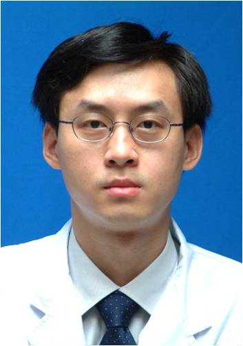

<!-- AUTO-GENERATED-BY: work/generate_obsidian_profiles.py -->

<!-- TEMPLATE: D:\workspace\信息收集整理\医生画像仓库\模板\医生画像模板.md -->

# 华平

## 基础信息

| 字段 | 内容 |
|---|---|
| 姓名 | 华平 |
| 医院 | 中山大学孙逸仙纪念医院 |
| 科室 | 心血管外科 |
| 职称/身份 | 教授, 主任医师 |
| 来源链接 | [官网原文](https://www.gzsys.org.cn/node/15199) |
| 采集日期 | 2026-08-13 |

## 简介/擅长

## 教育与进修经历

- 长期从事心血管外科临床工作，曾多次赴法国、瑞典及英国牛津大学心脏外科临床进修学习，对冠心病、心脏瓣膜病、先天性心脏病、大血管疾病等心脏外科疾病的外科诊治具有丰富的临床经验，多次成功抢救心肌梗死、重症瓣膜病、复杂先天性心脏病、夹层动脉瘤等危重症患者。

## 科研项目与成果

- 作为项目负责人主持国家自然科学基金、省部级科研基金多项，以第一作者／通讯作者发表SCI论文20余篇。

## 论文与学术产出

- 作为项目负责人主持国家自然科学基金、省部级科研基金多项，以第一作者／通讯作者发表SCI论文20余篇。

## 可包装亮点

- 中山大学孙逸仙纪念医院心血管外科教授、主任医师、医学博士、博士生导师、广东省杰出青年医学人才。
- 广东省医师协会心血管外科医师分会常委、广东省生物医学工程学会胸心血管外科分会常委、广东省医师协会心脏重症医师分会委员、广东省胸部疾病学会委员、欧洲心胸外科协会会员。
- 长期从事心血管外科临床工作，曾多次赴法国、瑞典及英国牛津大学心脏外科临床进修学习，对冠心病、心脏瓣膜病、先天性心脏病、大血管疾病等心脏外科疾病的外科诊治具有丰富的临床经验，多次成功抢救心肌梗死、重症瓣膜病、复杂先天性心脏病、夹层动脉瘤等危重症患者。
- 作为项目负责人主持国家自然科学基金、省部级科研基金多项，以第一作者／通讯作者发表SCI论文20余篇。

## 重点疾病/人群标签

- 慢性病：冠心病、瘤、危重、重症、复杂
- 肿瘤：冠心病、瘤、危重、重症、复杂
- 生殖疾病：
- 免疫/风湿：
- 术后恢复/康复：
- 疑难重症：冠心病、瘤、危重、重症、复杂

## 证据摘录

> 只摘录官网公开信息中的短句或关键字段，不复制大段原文。

- 官网身份字段：教授, 主任医师
- 官网亮眼经历线索：中山大学孙逸仙纪念医院心血管外科教授、主任医师、医学博士、博士生导师、广东省杰出青年医学人才。 广东省医师协会心血管外科医师分会常委、广东省生物医学工程学会胸心血管外科分会常委、广东省医师协会心脏重症医师分会委员、广东省胸部疾病学会委员、欧洲心胸外科协会会员。 长期从事心血管外科临床工作，曾多次赴法国、瑞典及英国牛津大学心脏外科临床进修学习，对冠心病、心脏瓣膜病、先天性心脏病、大血管疾病等心脏外科疾病的外科诊治具有丰富的临床经验，多次…
- 来源链接：https://www.gzsys.org.cn/node/15199

## BD 画像摘要

华平医生可作为慢性病、肿瘤、疑难重症方向的基础画像候选。后续 BD 使用应继续以官网来源和人工复核为准，不添加疗效承诺或无来源包装。

## 合规边界

- 仅使用医院官网、官方公众号、官方小程序等公开渠道。
- 不采集私人电话、私人微信、家庭住址、患者隐私或非公开排班信息。
- 不写“保证治愈”“疗效第一”“包治疑难杂症”等无法由官网证明的表述。
