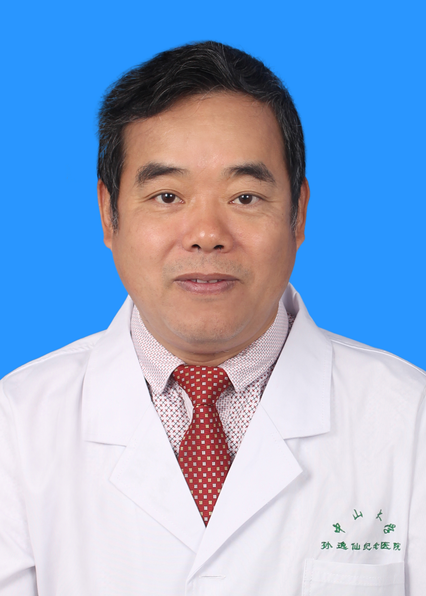

<!-- AUTO-GENERATED-BY: work/generate_obsidian_profiles.py -->

<!-- TEMPLATE: D:\workspace\信息收集整理\医生画像仓库\模板\医生画像模板.md -->

# 卢献平

## 基础信息

| 字段 | 内容 |
|---|---|
| 姓名 | 卢献平 |
| 医院 | 中山大学孙逸仙纪念医院 |
| 科室 | 核医学科 |
| 职称/身份 | 副主任医师 |
| 来源链接 | [官网原文](https://www.gzsys.org.cn/doctor/15217) |
| 采集日期 | 2026-08-13 |

## 简介/擅长

甲亢、甲状腺癌、甲状腺炎、结节性甲状腺肿；

## 教育与进修经历

- 1987年毕业于中山医科大学，一直在中山大学孙逸仙纪念医院从事核医学临床、教学和科研工作。

## 科研项目与成果

- 1987年毕业于中山医科大学，一直在中山大学孙逸仙纪念医院从事核医学临床、教学和科研工作。
- 参与国家、卫生部、省科技厅、省卫生厅、中山大学等各级科研课题的研究多项，发表学术60多篇，参编著作3部。

## 论文与学术产出

- 参与国家、卫生部、省科技厅、省卫生厅、中山大学等各级科研课题的研究多项，发表学术60多篇，参编著作3部。

## 可包装亮点

- 1991年到法国巴黎学习SPECT操作及诊断技术，1992年北京阜外医院学习心血管核医学诊断技术，2002年任副主任医师。
- 现任中华核医学会物理学组成员，广东省辐射防护学会委员，广东省和广州市医疗事故技术鉴定专家，主要研究方向：甲状腺疾病的诊断与治疗，皮肤血管瘤及疤痕的诊断与治疗。
- 参与国家、卫生部、省科技厅、省卫生厅、中山大学等各级科研课题的研究多项，发表学术60多篇，参编著作3部。
- 曾获省卫生厅、广州市科委、广东省科科技进步奖。

## 重点疾病/人群标签

- 慢性病：
- 肿瘤：癌、瘤
- 生殖疾病：
- 免疫/风湿：
- 术后恢复/康复：
- 疑难重症：

## 证据摘录

> 只摘录官网公开信息中的短句或关键字段，不复制大段原文。

- 官网身份字段：副主任医师
- 官网简介/擅长：甲亢、甲状腺癌、甲状腺炎、结节性甲状腺肿；
- 官网亮眼经历线索：1991年到法国巴黎学习SPECT操作及诊断技术，1992年北京阜外医院学习心血管核医学诊断技术，2002年任副主任医师。 现任中华核医学会物理学组成员，广东省辐射防护学会委员，广东省和广州市医疗事故技术鉴定专家，主要研究方向：甲状腺疾病的诊断与治疗，皮肤血管瘤及疤痕的诊断与治疗。 参与国家、卫生部、省科技厅、省卫生厅、中山大学等各级科研课题的研究多项，发表学术60多篇，参编著作3部。 曾获省卫生厅、广州市科委、广东省科科技进步奖。
- 来源链接：https://www.gzsys.org.cn/doctor/15217

## BD 画像摘要

卢献平医生可作为肿瘤方向的基础画像候选。后续 BD 使用应继续以官网来源和人工复核为准，不添加疗效承诺或无来源包装。

## 合规边界

- 仅使用医院官网、官方公众号、官方小程序等公开渠道。
- 不采集私人电话、私人微信、家庭住址、患者隐私或非公开排班信息。
- 不写“保证治愈”“疗效第一”“包治疑难杂症”等无法由官网证明的表述。
