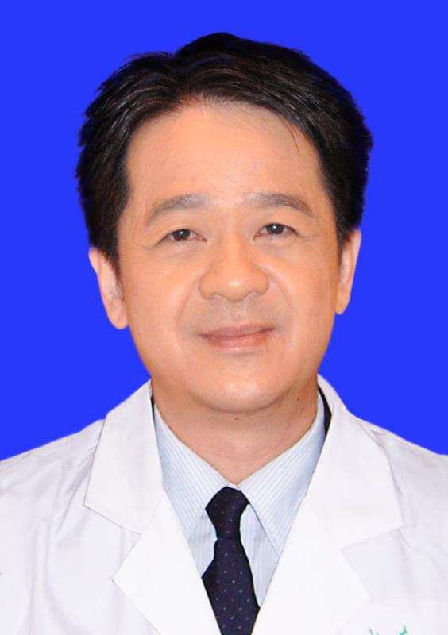

<!-- AUTO-GENERATED-BY: work/generate_obsidian_profiles.py -->

<!-- TEMPLATE: D:\workspace\信息收集整理\医生画像仓库\模板\医生画像模板.md -->

# 叶剑涛

## 基础信息

| 字段 | 内容 |
|---|---|
| 姓名 | 叶剑涛 |
| 医院 | 中山大学孙逸仙纪念医院 |
| 科室 | 口腔科 |
| 职称/身份 | 主任医师 |
| 来源链接 | [官网原文](https://www.gzsys.org.cn/doctor/14541) |
| 采集日期 | 2026-08-13 |

## 简介/擅长

## 科研项目与成果

- 主持省部级基金4项，以第一作者或通讯作者在国内外发表论文56篇，其中SCI收录论文12篇（JCR一区2篇，二区4篇），包括国际口腔专业主流杂志《Journal of Dentistry》、《Journal of Prosthetic Dentistry》、《European Journal of Oral Sciences》，直接指导和培养硕士研究生11人（全日制8人，在职3人），其中全日制4人被评为“中山大学优秀研究生”。

## 论文与学术产出

- 主持省部级基金4项，以第一作者或通讯作者在国内外发表论文56篇，其中SCI收录论文12篇（JCR一区2篇，二区4篇），包括国际口腔专业主流杂志《Journal of Dentistry》、《Journal of Prosthetic Dentistry》、《European Journal of Oral Sciences》，直接指导和培养硕士研究生11人（全日制8人，在职3人），其中全日制4人被评为“中山大学优秀研究生”。

## 可包装亮点

- 主任医师，教授，硕士研究生导师。
- 广东省口腔医学会口腔修复专委会常委，口腔种植专委会委员。
- 临床经验丰富，尤其擅长采用包括牙种植、各种义齿（镶牙）等多种技术手段治疗复杂、疑难病例。
- 主持省部级基金4项，以第一作者或通讯作者在国内外发表论文56篇，其中SCI收录论文12篇（JCR一区2篇，二区4篇），包括国际口腔专业主流杂志《Journal of Dentistry》、《Journal of Prosthetic Dentistry》、《European Journal of Oral Sciences》，直接指导和培养硕士研究生11人…

## 重点疾病/人群标签

- 慢性病：
- 肿瘤：
- 生殖疾病：
- 免疫/风湿：
- 术后恢复/康复：
- 疑难重症：疑难、复杂

## 证据摘录

> 只摘录官网公开信息中的短句或关键字段，不复制大段原文。

- 官网身份字段：主任医师
- 官网亮眼经历线索：主任医师，教授，硕士研究生导师。 广东省口腔医学会口腔修复专委会常委，口腔种植专委会委员。 临床经验丰富，尤其擅长采用包括牙种植、各种义齿（镶牙）等多种技术手段治疗复杂、疑难病例。 主持省部级基金4项，以第一作者或通讯作者在国内外发表论文56篇，其中SCI收录论文12篇（JCR一区2篇，二区4篇），包括国际口腔专业主流杂志《Journal of Dentistry》、《Journal of Prosthetic Dentistry》…
- 来源链接：https://www.gzsys.org.cn/doctor/14541

## BD 画像摘要

叶剑涛医生可作为疑难重症方向的基础画像候选。后续 BD 使用应继续以官网来源和人工复核为准，不添加疗效承诺或无来源包装。

## 合规边界

- 仅使用医院官网、官方公众号、官方小程序等公开渠道。
- 不采集私人电话、私人微信、家庭住址、患者隐私或非公开排班信息。
- 不写“保证治愈”“疗效第一”“包治疑难杂症”等无法由官网证明的表述。
