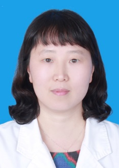

<!-- AUTO-GENERATED-BY: work/generate_obsidian_profiles.py -->

<!-- TEMPLATE: D:\workspace\信息收集整理\医生画像仓库\模板\医生画像模板.md -->

# 周晖

## 基础信息

| 字段 | 内容 |
|---|---|
| 姓名 | 周晖 |
| 医院 | 中山大学孙逸仙纪念医院 |
| 科室 | 妇科肿瘤专科 |
| 职称/身份 | 主任医师 |
| 来源链接 | [官网原文](https://www.gzsys.org.cn/doctor/14666) |
| 采集日期 | 2026-08-13 |

## 简介/擅长

妇科肿瘤及宫颈病变规范化诊治。

## 教育与进修经历

- 2018年香港大学玛丽医院临床高级访问学者。

## 科研项目与成果

- 担任中山大学医学院八年制及本科生及国家级继教项目授课。
- 主持、参与多项国家级、省厅级临床科研项目。

## 论文与学术产出

- 副主编发表学术专著2部，参编人民卫生出版社卫生部规划教材。
- 国内外核心期刊发表多篇论文。

## 可包装亮点

- 中山大学孙逸仙纪念妇产科主任医师，妇科肿瘤学博士，硕士研究生导师,妇科肿瘤一病区区长。
- 2018年香港大学玛丽医院临床高级访问学者。
- 担任广东省妇幼保健协会妇科专业委员会常委、广州抗癌协会病理学与分子病理诊断专委会常委、广东省医师协会妇科肿瘤专业委员会委员、广东省医学会宫颈病变专业委员会委员、广东省妇幼保健协会阴道镜与宫颈病理学组委员、CSCCP广东省分会委员、广东省中西医结合妇科肿瘤专业委员会委员。
- 副主编发表学术专著2部，参编人民卫生出版社卫生部规划教材。

## 重点疾病/人群标签

- 慢性病：
- 肿瘤：肿瘤、癌
- 生殖疾病：
- 免疫/风湿：
- 术后恢复/康复：
- 疑难重症：

## 证据摘录

> 只摘录官网公开信息中的短句或关键字段，不复制大段原文。

- 官网身份字段：主任医师
- 官网简介/擅长：妇科肿瘤及宫颈病变规范化诊治。
- 官网亮眼经历线索：中山大学孙逸仙纪念妇产科主任医师，妇科肿瘤学博士，硕士研究生导师,妇科肿瘤一病区区长。 2018年香港大学玛丽医院临床高级访问学者。 担任广东省妇幼保健协会妇科专业委员会常委、广州抗癌协会病理学与分子病理诊断专委会常委、广东省医师协会妇科肿瘤专业委员会委员、广东省医学会宫颈病变专业委员会委员、广东省妇幼保健协会阴道镜与宫颈病理学组委员、CSCCP广东省分会委员、广东省中西医结合妇科肿瘤专业委员会委员。 副主编发表学术专著2部，参编人民…
- 来源链接：https://www.gzsys.org.cn/doctor/14666

## BD 画像摘要

周晖医生可作为肿瘤方向的基础画像候选。后续 BD 使用应继续以官网来源和人工复核为准，不添加疗效承诺或无来源包装。

## 合规边界

- 仅使用医院官网、官方公众号、官方小程序等公开渠道。
- 不采集私人电话、私人微信、家庭住址、患者隐私或非公开排班信息。
- 不写“保证治愈”“疗效第一”“包治疑难杂症”等无法由官网证明的表述。
