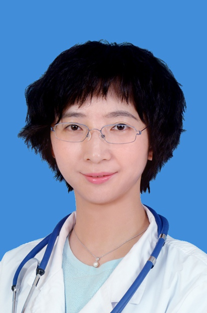

<!-- AUTO-GENERATED-BY: work/generate_obsidian_profiles.py -->

<!-- TEMPLATE: D:\workspace\信息收集整理\医生画像仓库\模板\医生画像模板.md -->

# 唐亚梅

## 基础信息

| 字段 | 内容 |
|---|---|
| 姓名 | 唐亚梅 |
| 医院 | 中山大学孙逸仙纪念医院 |
| 科室 | 神经科 |
| 职称/身份 | 教授, 主任医师, 研究员 |
| 来源链接 | [官网原文](https://www.gzsys.org.cn/node/14700) |
| 采集日期 | 2026-08-13 |

## 简介/擅长

## 科研项目与成果

- 2019年获国家杰出青年科学基金，2016年获国家优秀青年科学基金。
- 先后主持国家自然科学基金9项（含重点项目2项、国际(地区)合作与交流项目），并任科技创新2030-“脑科学与类脑研究”重大项目骨干、国家重点研发计划子课题负责人；
- 授权专利12项；

## 论文与学术产出

- 以最后通讯在JAMA、Nature Neuroscience、Nature Human Behaviour、Journal of Clinical Oncology、Science Translational Medicine、Neuron、Neuro-Oncology、Brain 等杂志发表SCI论文100余篇，获Nature Reviews Neuroscience亮点推荐，获邀在国际卒中大会、美国科学年会等进行报告；
- 牵头制定国内首部《放射性脑损伤诊治中国专家共识》，主编专著3项。

## 可包装亮点

- 唐亚梅，主任医师、教授、研究员、博士生导师。
- 现任中山大学孙逸仙纪念医院副院长、脑科学中心及神经科学科带头人；
- 担任中国神经科学学会理事、中华医学会神经病学分会委员、广东省医学会神经病学分会副主任委员、广东省医师协会神经内科医师分会副主任委员、广东省卒中学会副会长。
- 曾获首届中国十大杰出青年神经内科医师、教育部新世纪优秀人才、第七届树兰医学青年奖、广东省科技进步一等奖（第一完成人）；

## 重点疾病/人群标签

- 慢性病：
- 肿瘤：
- 生殖疾病：
- 免疫/风湿：
- 术后恢复/康复：
- 疑难重症：

## 证据摘录

> 只摘录官网公开信息中的短句或关键字段，不复制大段原文。

- 官网身份字段：教授, 主任医师, 研究员
- 官网亮眼经历线索：唐亚梅，主任医师、教授、研究员、博士生导师。 现任中山大学孙逸仙纪念医院副院长、脑科学中心及神经科学科带头人； 担任中国神经科学学会理事、中华医学会神经病学分会委员、广东省医学会神经病学分会副主任委员、广东省医师协会神经内科医师分会副主任委员、广东省卒中学会副会长。 曾获首届中国十大杰出青年神经内科医师、教育部新世纪优秀人才、第七届树兰医学青年奖、广东省科技进步一等奖（第一完成人）；
- 来源链接：https://www.gzsys.org.cn/node/14700

## BD 画像摘要

唐亚梅医生可作为中山大学孙逸仙纪念医院神经科的基础医生资料入库。当前重点方向以总底表标签为准，官网未展示的信息保持空白。

## 合规边界

- 仅使用医院官网、官方公众号、官方小程序等公开渠道。
- 不采集私人电话、私人微信、家庭住址、患者隐私或非公开排班信息。
- 不写“保证治愈”“疗效第一”“包治疑难杂症”等无法由官网证明的表述。
