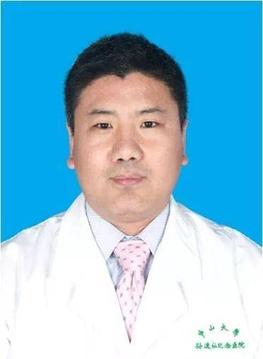

<!-- AUTO-GENERATED-BY: work/generate_obsidian_profiles.py -->

<!-- TEMPLATE: D:\workspace\信息收集整理\医生画像仓库\模板\医生画像模板.md -->

# 唐启彬

## 基础信息

| 字段 | 内容 |
|---|---|
| 姓名 | 唐启彬 |
| 医院 | 中山大学孙逸仙纪念医院 |
| 科室 | 胆胰外科 |
| 职称/身份 | 副主任医师 |
| 来源链接 | [官网原文](https://www.gzsys.org.cn/node/15206) |
| 采集日期 | 2026-08-13 |

## 简介/擅长

## 教育与进修经历

- 华中科技大学同济医学院博士毕业。

## 科研项目与成果

- 承担国家及省部级科研基金5项，在国内外学术期刊发表学术论文20余篇。

## 论文与学术产出

- 承担国家及省部级科研基金5项，在国内外学术期刊发表学术论文20余篇。

## 可包装亮点

- 医学博士，硕士研究生导师，副主任医师。
- 承担国家及省部级科研基金5项，在国内外学术期刊发表学术论文20余篇。
- 目前社会任职： 中国抗癌协会胆道肿瘤专业委员会委员 中国医师协会外科分会信息传播与教育专业委员会委员 广东省抗癌协会胰腺癌专业委员会常委兼青年委员会主任委员 广东省抗癌协会胆道肿瘤专业青年委员会副主任委员 广东省医学会外科分会胆道肿瘤学组组员兼秘书 广东省医师协会胰腺外科医师分会委员 广东省临床医学学会-华南名医专家委员会 医学专家会员

## 重点疾病/人群标签

- 慢性病：慢性、肿瘤、癌、肝癌
- 肿瘤：慢性、肿瘤、癌、肝癌
- 生殖疾病：
- 免疫/风湿：
- 术后恢复/康复：
- 疑难重症：

## 证据摘录

> 只摘录官网公开信息中的短句或关键字段，不复制大段原文。

- 官网身份字段：副主任医师
- 官网亮眼经历线索：医学博士，硕士研究生导师，副主任医师。 承担国家及省部级科研基金5项，在国内外学术期刊发表学术论文20余篇。 目前社会任职： 中国抗癌协会胆道肿瘤专业委员会委员 中国医师协会外科分会信息传播与教育专业委员会委员 广东省抗癌协会胰腺癌专业委员会常委兼青年委员会主任委员 广东省抗癌协会胆道肿瘤专业青年委员会副主任委员 广东省医学会外科分会胆道肿瘤学组组员兼秘书 广东省医师协会胰腺外科医师分会委员 广东省临床医学学会-华南名医专家委员会 医…
- 来源链接：https://www.gzsys.org.cn/node/15206

## BD 画像摘要

唐启彬医生可作为慢性病、肿瘤方向的基础画像候选。后续 BD 使用应继续以官网来源和人工复核为准，不添加疗效承诺或无来源包装。

## 合规边界

- 仅使用医院官网、官方公众号、官方小程序等公开渠道。
- 不采集私人电话、私人微信、家庭住址、患者隐私或非公开排班信息。
- 不写“保证治愈”“疗效第一”“包治疑难杂症”等无法由官网证明的表述。
