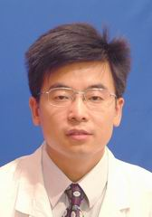

<!-- AUTO-GENERATED-BY: work/generate_obsidian_profiles.py -->

<!-- TEMPLATE: D:\workspace\信息收集整理\医生画像仓库\模板\医生画像模板.md -->

# 孟哲

## 基础信息

| 字段 | 内容 |
|---|---|
| 姓名 | 孟哲 |
| 医院 | 中山大学孙逸仙纪念医院 |
| 科室 | 儿科神经内分泌专科 |
| 职称/身份 | 副主任医师 |
| 来源链接 | [官网原文](https://www.gzsys.org.cn/node/14698) |
| 采集日期 | 2026-08-13 |

## 简介/擅长

治疗儿童和青少年内分泌疾病如：矮小症、肥胖症、性早熟、甲状腺病、糖尿病、小阴茎、性腺发育不良、青春期发育障碍等和遗传代谢性疾病如：染色体病、糖、脂肪、氨基酸、有机酸代谢异常等。

## 教育与进修经历

- 曾参加亚太儿科内分泌协会青年医师培训，主持和参与多项课题研究，发表论文多篇，主译人民卫生出版社《波特儿科指导手册》，参编《小儿遗传与遗传性疾病》等著作。

## 科研项目与成果

- 曾参加亚太儿科内分泌协会青年医师培训，主持和参与多项课题研究，发表论文多篇，主译人民卫生出版社《波特儿科指导手册》，参编《小儿遗传与遗传性疾病》等著作。

## 论文与学术产出

- 曾参加亚太儿科内分泌协会青年医师培训，主持和参与多项课题研究，发表论文多篇，主译人民卫生出版社《波特儿科指导手册》，参编《小儿遗传与遗传性疾病》等著作。

## 可包装亮点

- 副主任医师，中华医学会儿科内分泌和遗传代谢病分会中青年委员；
- 广东省医学会儿科学分会儿科内分泌学组组员；
- 广东省健康管理学会儿科学及青少年健康管理专业委员会委员。
- 曾参加亚太儿科内分泌协会青年医师培训，主持和参与多项课题研究，发表论文多篇，主译人民卫生出版社《波特儿科指导手册》，参编《小儿遗传与遗传性疾病》等著作。

## 重点疾病/人群标签

- 慢性病：糖尿病、代谢
- 肿瘤：
- 生殖疾病：
- 免疫/风湿：
- 术后恢复/康复：
- 疑难重症：

## 证据摘录

> 只摘录官网公开信息中的短句或关键字段，不复制大段原文。

- 官网身份字段：副主任医师
- 官网简介/擅长：治疗儿童和青少年内分泌疾病如：矮小症、肥胖症、性早熟、甲状腺病、糖尿病、小阴茎、性腺发育不良、青春期发育障碍等和遗传代谢性疾病如：染色体病、糖、脂肪、氨基酸、有机酸代谢异常等。
- 官网亮眼经历线索：副主任医师，中华医学会儿科内分泌和遗传代谢病分会中青年委员； 广东省医学会儿科学分会儿科内分泌学组组员； 广东省健康管理学会儿科学及青少年健康管理专业委员会委员。 曾参加亚太儿科内分泌协会青年医师培训，主持和参与多项课题研究，发表论文多篇，主译人民卫生出版社《波特儿科指导手册》，参编《小儿遗传与遗传性疾病》等著作。
- 来源链接：https://www.gzsys.org.cn/node/14698

## BD 画像摘要

孟哲医生可作为慢性病方向的基础画像候选。后续 BD 使用应继续以官网来源和人工复核为准，不添加疗效承诺或无来源包装。

## 合规边界

- 仅使用医院官网、官方公众号、官方小程序等公开渠道。
- 不采集私人电话、私人微信、家庭住址、患者隐私或非公开排班信息。
- 不写“保证治愈”“疗效第一”“包治疑难杂症”等无法由官网证明的表述。
