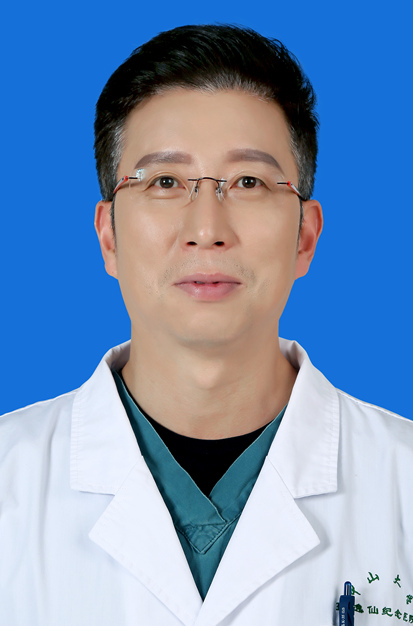

<!-- AUTO-GENERATED-BY: work/generate_obsidian_profiles.py -->

<!-- TEMPLATE: D:\workspace\信息收集整理\医生画像仓库\模板\医生画像模板.md -->

# 宋卫东

## 基础信息

| 字段 | 内容 |
|---|---|
| 姓名 | 宋卫东 |
| 医院 | 中山大学孙逸仙纪念医院 |
| 科室 | 骨外科 |
| 职称/身份 | 主任医师 |
| 来源链接 | [官网原文](https://www.gzsys.org.cn/node/14678) |
| 采集日期 | 2026-08-13 |

## 简介/擅长

## 可包装亮点

- 美国足踝外科协会国际会员（AOFAS），国际矫形与创伤外科学会足踝外科学会常委（SICOT），中华医学会骨科学分会第十一届委员会足踝外科学组委员，中国医师协会骨科医生分会足踝基础及矫形学组副组长，广东省临床医学学会足踝外科专业委员会第一届名誉主委，广东省医学会关节外科学会第三届委员会足踝外科学组长，广东省医师协会创伤骨科医师分会第一届委员会副主任委员，“中…

## 重点疾病/人群标签

- 慢性病：
- 肿瘤：
- 生殖疾病：
- 免疫/风湿：
- 术后恢复/康复：
- 疑难重症：

## 证据摘录

> 只摘录官网公开信息中的短句或关键字段，不复制大段原文。

- 官网身份字段：主任医师
- 官网亮眼经历线索：美国足踝外科协会国际会员（AOFAS），国际矫形与创伤外科学会足踝外科学会常委（SICOT），中华医学会骨科学分会第十一届委员会足踝外科学组委员，中国医师协会骨科医生分会足踝基础及矫形学组副组长，广东省临床医学学会足踝外科专业委员会第一届名誉主委，广东省医学会关节外科学会第三届委员会足踝外科学组长，广东省医师协会创伤骨科医师分会第一届委员会副主任委员，“中华足踝继续医学教育学院”副院长，“中华足踝继续医学教育学院”广东省分院院长。
- 来源链接：https://www.gzsys.org.cn/node/14678

## BD 画像摘要

宋卫东医生可作为中山大学孙逸仙纪念医院骨外科的基础医生资料入库。当前重点方向以总底表标签为准，官网未展示的信息保持空白。

## 合规边界

- 仅使用医院官网、官方公众号、官方小程序等公开渠道。
- 不采集私人电话、私人微信、家庭住址、患者隐私或非公开排班信息。
- 不写“保证治愈”“疗效第一”“包治疑难杂症”等无法由官网证明的表述。
