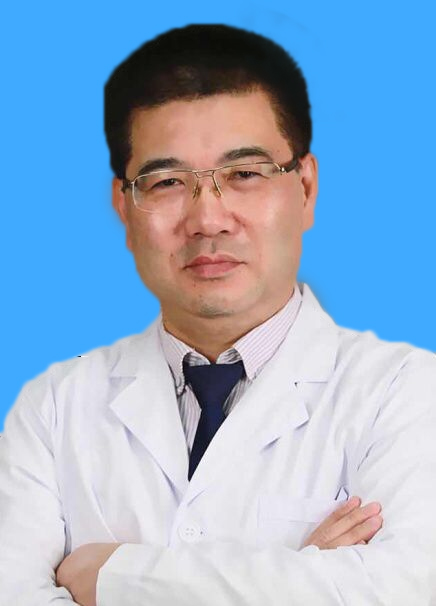

<!-- AUTO-GENERATED-BY: work/generate_obsidian_profiles.py -->

<!-- TEMPLATE: D:\workspace\信息收集整理\医生画像仓库\模板\医生画像模板.md -->

# 常少海

## 基础信息

| 字段 | 内容 |
|---|---|
| 姓名 | 常少海 |
| 医院 | 中山大学孙逸仙纪念医院 |
| 科室 | 口腔科 |
| 职称/身份 | 主任医师 |
| 来源链接 | [官网原文](https://www.gzsys.org.cn/doctor/14540) |
| 采集日期 | 2026-08-13 |

## 简介/擅长

1、擅长各种矫治方法对各种口腔畸形进行矫治，针对不同错合畸形采用最适矫治器，以达到经济、快捷、高效的效果。

## 科研项目与成果

- 主持和参与了近十项国家和省级科研基金；
- 完成了一项实用发明专利。

## 论文与学术产出

- 在国内外核心期刊发表了科学论文数十篇。

## 可包装亮点

- 口腔正畸专科主任 师从世界著名矫正大师哈佛大学严开仁教授，专注口腔正畸临床工作三十余年。
- 完成了一项实用发明专利。
- 在国内外核心期刊发表了科学论文数十篇。

## 重点疾病/人群标签

- 慢性病：
- 肿瘤：
- 生殖疾病：
- 免疫/风湿：
- 术后恢复/康复：
- 疑难重症：

## 证据摘录

> 只摘录官网公开信息中的短句或关键字段，不复制大段原文。

- 官网身份字段：主任医师
- 官网简介/擅长：1、擅长各种矫治方法对各种口腔畸形进行矫治，针对不同错合畸形采用最适矫治器，以达到经济、快捷、高效的效果。
- 官网亮眼经历线索：口腔正畸专科主任 师从世界著名矫正大师哈佛大学严开仁教授，专注口腔正畸临床工作三十余年。 完成了一项实用发明专利。 在国内外核心期刊发表了科学论文数十篇。
- 来源链接：https://www.gzsys.org.cn/doctor/14540

## BD 画像摘要

常少海医生可作为中山大学孙逸仙纪念医院口腔科的基础医生资料入库。当前重点方向以总底表标签为准，官网未展示的信息保持空白。

## 合规边界

- 仅使用医院官网、官方公众号、官方小程序等公开渠道。
- 不采集私人电话、私人微信、家庭住址、患者隐私或非公开排班信息。
- 不写“保证治愈”“疗效第一”“包治疑难杂症”等无法由官网证明的表述。
