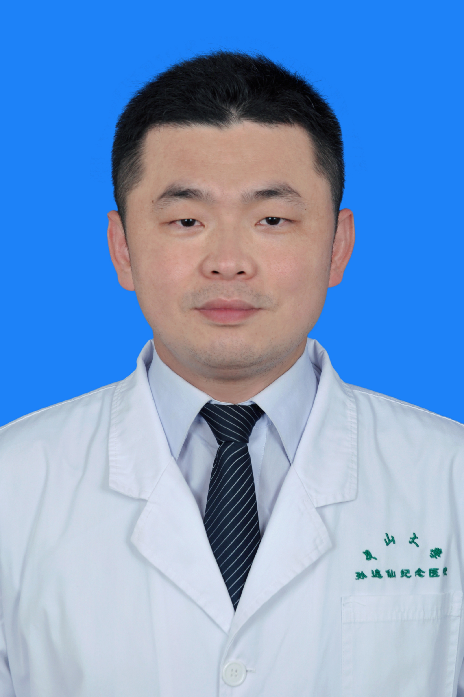

<!-- AUTO-GENERATED-BY: work/generate_obsidian_profiles.py -->

<!-- TEMPLATE: D:\workspace\信息收集整理\医生画像仓库\模板\医生画像模板.md -->

# 庄沛林

## 基础信息

| 字段 | 内容 |
|---|---|
| 姓名 | 庄沛林 |
| 医院 | 中山大学孙逸仙纪念医院 |
| 科室 | 口腔科 |
| 职称/身份 | 副主任医师 |
| 来源链接 | [官网原文](https://www.gzsys.org.cn/node/14762) |
| 采集日期 | 2026-08-13 |

## 简介/擅长

## 教育与进修经历

- 2004年毕业于中山大学并留校任职，对口腔科常见病和多发病的诊治有丰富的临床经验，擅长牙齿保存治疗、种植修复、牙列缺损修复、显微根管治疗、显微根尖手术等。

## 可包装亮点

-

## 重点疾病/人群标签

- 慢性病：
- 肿瘤：
- 生殖疾病：
- 免疫/风湿：
- 术后恢复/康复：
- 疑难重症：

## 证据摘录

> 只摘录官网公开信息中的短句或关键字段，不复制大段原文。

- 官网身份字段：副主任医师
- 来源链接：https://www.gzsys.org.cn/node/14762

## BD 画像摘要

庄沛林医生可作为中山大学孙逸仙纪念医院口腔科的基础医生资料入库。当前重点方向以总底表标签为准，官网未展示的信息保持空白。

## 合规边界

- 仅使用医院官网、官方公众号、官方小程序等公开渠道。
- 不采集私人电话、私人微信、家庭住址、患者隐私或非公开排班信息。
- 不写“保证治愈”“疗效第一”“包治疑难杂症”等无法由官网证明的表述。
