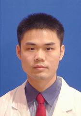

<!-- AUTO-GENERATED-BY: work/generate_obsidian_profiles.py -->

<!-- TEMPLATE: D:\workspace\信息收集整理\医生画像仓库\模板\医生画像模板.md -->

# 廖日房

## 基础信息

| 字段 | 内容 |
|---|---|
| 姓名 | 廖日房 |
| 医院 | 中山大学孙逸仙纪念医院 |
| 科室 | 药学部 |
| 职称/身份 | 主任药师 |
| 来源链接 | [官网原文](https://www.gzsys.org.cn/node/14657) |
| 采集日期 | 2026-08-13 |

## 简介/擅长

## 教育与进修经历

- 主任药师，药理学博士，昆士兰大学访问学者，国家卫健委临床药师培训基地师资（心血从事临床药学工作20余年，主要研究方向是临床药理，临床用药评价。

## 科研项目与成果

- 国家管专业），近5年主持省自然基金等项目5项，获广东省医院药学科技奖3等奖，发表SCI论文10余篇，参编《药源性消化系统疾病》、《说明书外用药参考》论著2部，擅长冠心病、房颤等用药咨询。

## 论文与学术产出

- 国家管专业），近5年主持省自然基金等项目5项，获广东省医院药学科技奖3等奖，发表SCI论文10余篇，参编《药源性消化系统疾病》、《说明书外用药参考》论著2部，擅长冠心病、房颤等用药咨询。

## 可包装亮点

- 主任药师，药理学博士，昆士兰大学访问学者，国家卫健委临床药师培训基地师资（心血从事临床药学工作20余年，主要研究方向是临床药理，临床用药评价。
- 国家管专业），近5年主持省自然基金等项目5项，获广东省医院药学科技奖3等奖，发表SCI论文10余篇，参编《药源性消化系统疾病》、《说明书外用药参考》论著2部，擅长冠心病、房颤等用药咨询。

## 重点疾病/人群标签

- 慢性病：
- 肿瘤：
- 生殖疾病：
- 免疫/风湿：
- 术后恢复/康复：
- 疑难重症：

## 证据摘录

> 只摘录官网公开信息中的短句或关键字段，不复制大段原文。

- 官网身份字段：主任药师
- 官网亮眼经历线索：主任药师，药理学博士，昆士兰大学访问学者，国家卫健委临床药师培训基地师资（心血从事临床药学工作20余年，主要研究方向是临床药理，临床用药评价。 国家管专业），近5年主持省自然基金等项目5项，获广东省医院药学科技奖3等奖，发表SCI论文10余篇，参编《药源性消化系统疾病》、《说明书外用药参考》论著2部，擅长冠心病、房颤等用药咨询。
- 异常提示：职称/身份需人工复核
- 来源链接：https://www.gzsys.org.cn/node/14657

## BD 画像摘要

廖日房医生可作为中山大学孙逸仙纪念医院药学部的基础医生资料入库。当前重点方向以总底表标签为准，官网未展示的信息保持空白。

## 合规边界

- 仅使用医院官网、官方公众号、官方小程序等公开渠道。
- 不采集私人电话、私人微信、家庭住址、患者隐私或非公开排班信息。
- 不写“保证治愈”“疗效第一”“包治疑难杂症”等无法由官网证明的表述。
