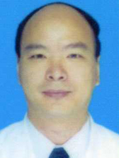

<!-- AUTO-GENERATED-BY: work/generate_obsidian_profiles.py -->

<!-- TEMPLATE: D:\workspace\信息收集整理\医生画像仓库\模板\医生画像模板.md -->

# 张世能

## 基础信息

| 字段 | 内容 |
|---|---|
| 姓名 | 张世能 |
| 医院 | 中山大学孙逸仙纪念医院 |
| 科室 | 消化内科 |
| 职称/身份 | 教授, 主任医师 |
| 来源链接 | [官网原文](https://www.gzsys.org.cn/node/14812) |
| 采集日期 | 2026-08-13 |

## 简介/擅长

## 教育与进修经历

- 2000年于中山大学胃肠病学博士毕业，2001~2003年先后在美国明尼苏达大学和南加州大学从事博士后研究。

## 科研项目与成果

- 主持国家和省部级科研项目10余项，以第一完成人荣获广东省科技进步二等奖，参与完成广东省科技进步三等奖。
- 从事消化内科医疗、教学和科研工作30余年，擅长慢性胃炎、溃疡病、功能性胃肠病、胃食管反流病、炎症性肠病、肝硬化、胰腺炎、胰腺癌和胃肠镜诊治技术。

## 论文与学术产出

- 在《Mol Cancer》、《Cancer Research》、《Int J Oncol》和《Dig Dis Sci》等国内外专业期刊发表研究论文近70篇，参与编写专著12部。

## 可包装亮点

- 消化内科教授、主任医师、博士生导师。
- 2000年于中山大学胃肠病学博士毕业，2001~2003年先后在美国明尼苏达大学和南加州大学从事博士后研究。
- 主持国家和省部级科研项目10余项，以第一完成人荣获广东省科技进步二等奖，参与完成广东省科技进步三等奖。
- 中国中西医结合学会肠病和胶囊内镜专委会副主任委员，广东省医师协会消化医师分会副主任委员、广东省医学会消化内镜分会常委，广东省抗癌协会胰腺癌委员会委员。

## 重点疾病/人群标签

- 慢性病：慢性、癌
- 肿瘤：慢性、癌
- 生殖疾病：
- 免疫/风湿：
- 术后恢复/康复：
- 疑难重症：

## 证据摘录

> 只摘录官网公开信息中的短句或关键字段，不复制大段原文。

- 官网身份字段：教授, 主任医师
- 官网亮眼经历线索：消化内科教授、主任医师、博士生导师。 2000年于中山大学胃肠病学博士毕业，2001~2003年先后在美国明尼苏达大学和南加州大学从事博士后研究。 主持国家和省部级科研项目10余项，以第一完成人荣获广东省科技进步二等奖，参与完成广东省科技进步三等奖。 中国中西医结合学会肠病和胶囊内镜专委会副主任委员，广东省医师协会消化医师分会副主任委员、广东省医学会消化内镜分会常委，广东省抗癌协会胰腺癌委员会委员。
- 来源链接：https://www.gzsys.org.cn/node/14812

## BD 画像摘要

张世能医生可作为慢性病、肿瘤方向的基础画像候选。后续 BD 使用应继续以官网来源和人工复核为准，不添加疗效承诺或无来源包装。

## 合规边界

- 仅使用医院官网、官方公众号、官方小程序等公开渠道。
- 不采集私人电话、私人微信、家庭住址、患者隐私或非公开排班信息。
- 不写“保证治愈”“疗效第一”“包治疑难杂症”等无法由官网证明的表述。
