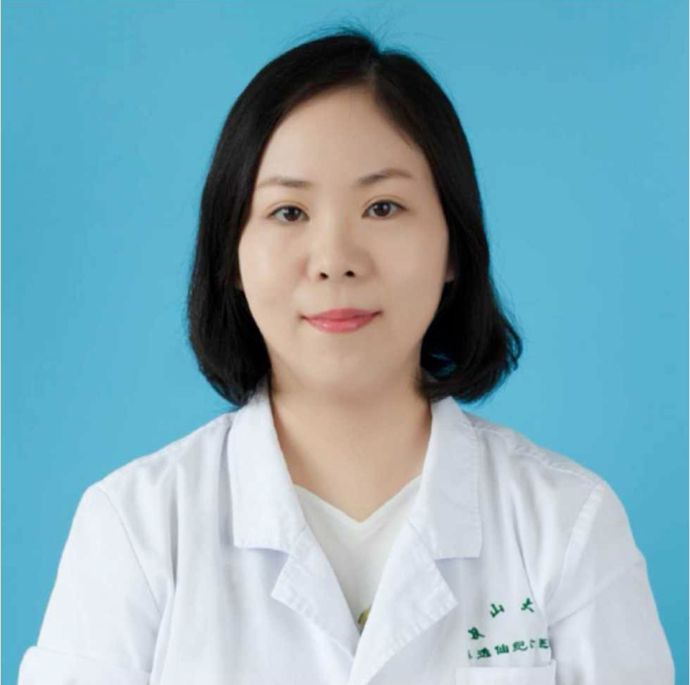

<!-- AUTO-GENERATED-BY: work/generate_obsidian_profiles.py -->

<!-- TEMPLATE: D:\workspace\信息收集整理\医生画像仓库\模板\医生画像模板.md -->

# 张佳琦

## 基础信息

| 字段 | 内容 |
|---|---|
| 姓名 | 张佳琦 |
| 医院 | 中山大学孙逸仙纪念医院 |
| 科室 | 整形外科 |
| 职称/身份 | 副主任医师 |
| 来源链接 | [官网原文](https://www.gzsys.org.cn/doctor/15477) |
| 采集日期 | 2026-08-13 |

## 简介/擅长

## 教育与进修经历

- 2014年毕业于中山大学并取得整形外科学硕士学位，随后进入中山大学孙逸仙纪念医院工作，取得了整形外科副主任医师及美容外科主诊医师资格。

## 科研项目与成果

- 此外，在临床科研方面也取得了多项成果，硕士研究生阶段主攻胸壁肿瘤的切除与皮瓣修复，并以第一或者共同作者在国内外核心期刊上发表论文十余篇。

## 论文与学术产出

- 此外，在临床科研方面也取得了多项成果，硕士研究生阶段主攻胸壁肿瘤的切除与皮瓣修复，并以第一或者共同作者在国内外核心期刊上发表论文十余篇。

## 可包装亮点

- 2014年毕业于中山大学并取得整形外科学硕士学位，随后进入中山大学孙逸仙纪念医院工作，取得了整形外科副主任医师及美容外科主诊医师资格。
- 对于整形外科常见病，疑难病的处理有丰富的临床经验，熟练掌握各种美容类手术以及各类整形外科相关畸形修复。
- 此外，在临床科研方面也取得了多项成果，硕士研究生阶段主攻胸壁肿瘤的切除与皮瓣修复，并以第一或者共同作者在国内外核心期刊上发表论文十余篇。
- 并且在工作期间参与多次演讲与比赛，目前是广东省整形美容协会整形美容外科学分会委员兼秘书，广东省女医师协会整形美容专业委员会委员。

## 重点疾病/人群标签

- 慢性病：
- 肿瘤：肿瘤、术后、疑难
- 生殖疾病：
- 免疫/风湿：
- 术后恢复/康复：肿瘤、术后、疑难
- 疑难重症：肿瘤、术后、疑难

## 证据摘录

> 只摘录官网公开信息中的短句或关键字段，不复制大段原文。

- 官网身份字段：副主任医师
- 官网亮眼经历线索：2014年毕业于中山大学并取得整形外科学硕士学位，随后进入中山大学孙逸仙纪念医院工作，取得了整形外科副主任医师及美容外科主诊医师资格。 对于整形外科常见病，疑难病的处理有丰富的临床经验，熟练掌握各种美容类手术以及各类整形外科相关畸形修复。 此外，在临床科研方面也取得了多项成果，硕士研究生阶段主攻胸壁肿瘤的切除与皮瓣修复，并以第一或者共同作者在国内外核心期刊上发表论文十余篇。 并且在工作期间参与多次演讲与比赛，目前是广东省整形美容协会整…
- 来源链接：https://www.gzsys.org.cn/doctor/15477

## BD 画像摘要

张佳琦医生可作为肿瘤、术后恢复/康复、疑难重症方向的基础画像候选。后续 BD 使用应继续以官网来源和人工复核为准，不添加疗效承诺或无来源包装。

## 合规边界

- 仅使用医院官网、官方公众号、官方小程序等公开渠道。
- 不采集私人电话、私人微信、家庭住址、患者隐私或非公开排班信息。
- 不写“保证治愈”“疗效第一”“包治疑难杂症”等无法由官网证明的表述。
