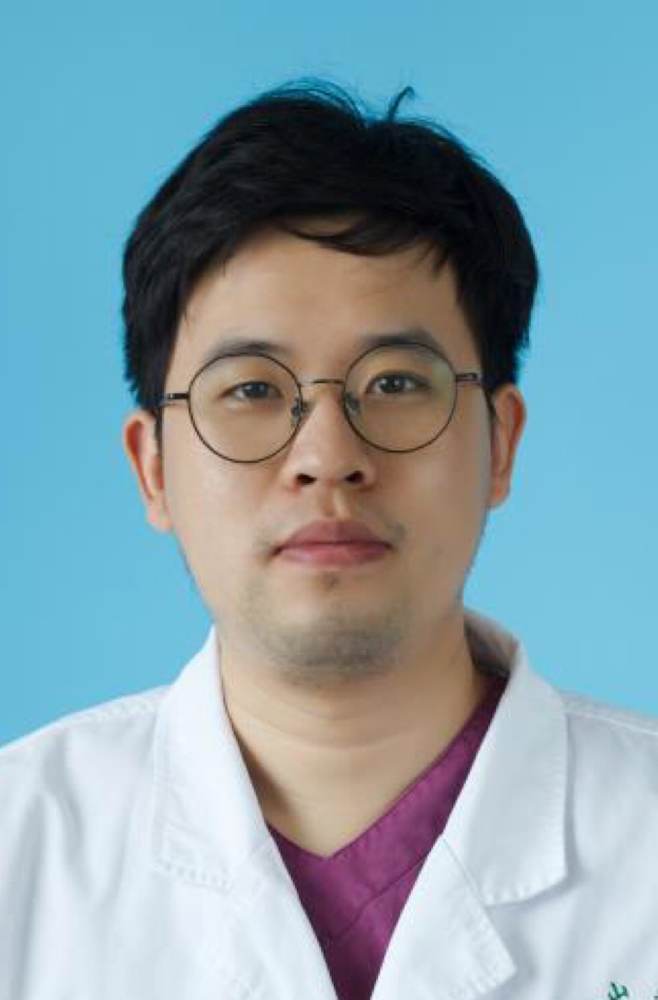

<!-- AUTO-GENERATED-BY: work/generate_obsidian_profiles.py -->

<!-- TEMPLATE: D:\workspace\信息收集整理\医生画像仓库\模板\医生画像模板.md -->

# 张剑

## 基础信息

| 字段 | 内容 |
|---|---|
| 姓名 | 张剑 |
| 医院 | 中山大学孙逸仙纪念医院 |
| 科室 | 整形外科 |
| 职称/身份 | 主治医师 |
| 来源链接 | [官网原文](https://www.gzsys.org.cn/doctor/15501) |
| 采集日期 | 2026-08-13 |

## 简介/擅长

## 教育与进修经历

- 整形美容外科主治医师，中山大学外科学博士学位，广东省整形美容协会青年学术委员会委员。
- 中山大学毕业后即进入中山大学孙逸仙纪念医院工作，一直从事整形美容外科及创面修复临床工作5年余，积累了丰富的临床经验，擅长：体表肿瘤切除与整形性修复，眼鼻整形，面部年轻化，脂肪抽吸及注射微整形，难愈性创面的综合治疗。

## 科研项目与成果

- 主持及参与多项国家级及省级科研项目及临床研究项目，以第一作者身份在国内外杂志发表多篇论文，并有论文被纳入2016 WHS （Wound Healing Society）指南。

## 论文与学术产出

- 主持及参与多项国家级及省级科研项目及临床研究项目，以第一作者身份在国内外杂志发表多篇论文，并有论文被纳入2016 WHS （Wound Healing Society）指南。

## 可包装亮点

- 整形美容外科主治医师，中山大学外科学博士学位，广东省整形美容协会青年学术委员会委员。
- 主持及参与多项国家级及省级科研项目及临床研究项目，以第一作者身份在国内外杂志发表多篇论文，并有论文被纳入2016 WHS （Wound Healing Society）指南。

## 重点疾病/人群标签

- 慢性病：
- 肿瘤：肿瘤、创面
- 生殖疾病：
- 免疫/风湿：
- 术后恢复/康复：肿瘤、创面
- 疑难重症：

## 证据摘录

> 只摘录官网公开信息中的短句或关键字段，不复制大段原文。

- 官网身份字段：主治医师
- 官网亮眼经历线索：整形美容外科主治医师，中山大学外科学博士学位，广东省整形美容协会青年学术委员会委员。 主持及参与多项国家级及省级科研项目及临床研究项目，以第一作者身份在国内外杂志发表多篇论文，并有论文被纳入2016 WHS （Wound Healing Society）指南。
- 来源链接：https://www.gzsys.org.cn/doctor/15501

## BD 画像摘要

张剑医生可作为肿瘤、术后恢复/康复方向的基础画像候选。后续 BD 使用应继续以官网来源和人工复核为准，不添加疗效承诺或无来源包装。

## 合规边界

- 仅使用医院官网、官方公众号、官方小程序等公开渠道。
- 不采集私人电话、私人微信、家庭住址、患者隐私或非公开排班信息。
- 不写“保证治愈”“疗效第一”“包治疑难杂症”等无法由官网证明的表述。
