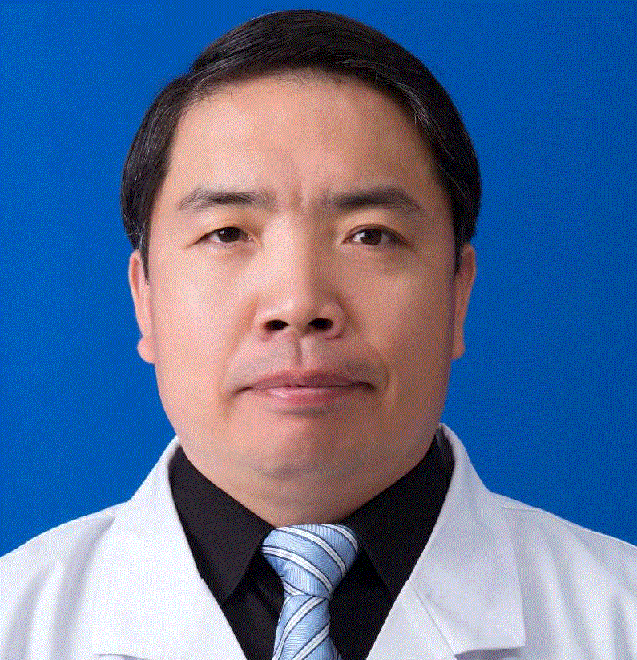

<!-- AUTO-GENERATED-BY: work/generate_obsidian_profiles.py -->

<!-- TEMPLATE: D:\workspace\信息收集整理\医生画像仓库\模板\医生画像模板.md -->

# 张善义

## 基础信息

| 字段 | 内容 |
|---|---|
| 姓名 | 张善义 |
| 医院 | 中山大学孙逸仙纪念医院 |
| 科室 | 神经外科 |
| 职称/身份 | 副主任医师 |
| 来源链接 | [官网原文](https://www.gzsys.org.cn/node/14757) |
| 采集日期 | 2026-08-13 |

## 简介/擅长

## 教育与进修经历

- 中山大学外科学博士毕业后留院工作，从事神经外科临床工作10余年，临床经验丰富，主攻脑肿瘤手术治疗及相关基础研究，尤其擅长胶质瘤、脑膜瘤、垂体瘤、三叉神经痛及复杂颅底肿瘤的外科手术。

## 科研项目与成果

- 承担脑肿瘤相关国家自然科学基金5项，省部级科研基金2项，目前在研科研经费20余万元。

## 论文与学术产出

- 近2年，以第一或通讯作者在国际肿瘤著名期刊international journal of cancer、脑肿瘤知名期刊journal of neuro-oncology、国际著名医学期刊Cell Death & Disease等国际期刊发表脑肿瘤SCI论文20多篇，其中影响因子IF>7.0以上2篇，IF>5.0以上4篇，中华系列期刊多篇，参编、参译论著2本。

## 可包装亮点

- 广东医学会神经外科分会青年委员，广东省基层医药协会神经外科委员会秘书长，广东省抗癌协会神经肿瘤分会常委。
- 2015年外方资助在德国埃森大学神经外科访问学习。
- 国家公派2017年12月至2019年3月，在世界知名英国卡迪夫大学肿瘤研究所进行脑肿瘤相关研究。
- 近2年，以第一或通讯作者在国际肿瘤著名期刊international journal of cancer、脑肿瘤知名期刊journal of neuro-oncology、国际著名医学期刊Cell Death & Disease等国际期刊发表脑肿瘤SCI论文20多篇，其中影响因子IF>7.0以上2篇，IF>5.0以上4篇，中华系列期刊多篇，参编、参译论著2…

## 重点疾病/人群标签

- 慢性病：
- 肿瘤：肿瘤、癌、瘤、复杂
- 生殖疾病：
- 免疫/风湿：
- 术后恢复/康复：
- 疑难重症：肿瘤、癌、瘤、复杂

## 证据摘录

> 只摘录官网公开信息中的短句或关键字段，不复制大段原文。

- 官网身份字段：副主任医师
- 官网亮眼经历线索：广东医学会神经外科分会青年委员，广东省基层医药协会神经外科委员会秘书长，广东省抗癌协会神经肿瘤分会常委。 2015年外方资助在德国埃森大学神经外科访问学习。 国家公派2017年12月至2019年3月，在世界知名英国卡迪夫大学肿瘤研究所进行脑肿瘤相关研究。 近2年，以第一或通讯作者在国际肿瘤著名期刊international journal of cancer、脑肿瘤知名期刊journal of neuro-oncology、国际著名医…
- 来源链接：https://www.gzsys.org.cn/node/14757

## BD 画像摘要

张善义医生可作为肿瘤、疑难重症方向的基础画像候选。后续 BD 使用应继续以官网来源和人工复核为准，不添加疗效承诺或无来源包装。

## 合规边界

- 仅使用医院官网、官方公众号、官方小程序等公开渠道。
- 不采集私人电话、私人微信、家庭住址、患者隐私或非公开排班信息。
- 不写“保证治愈”“疗效第一”“包治疑难杂症”等无法由官网证明的表述。
