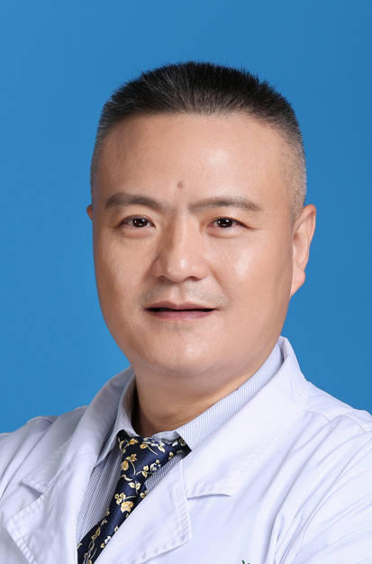

<!-- AUTO-GENERATED-BY: work/generate_obsidian_profiles.py -->

<!-- TEMPLATE: D:\workspace\信息收集整理\医生画像仓库\模板\医生画像模板.md -->

# 张建龙

## 基础信息

| 字段 | 内容 |
|---|---|
| 姓名 | 张建龙 |
| 医院 | 中山大学孙逸仙纪念医院 |
| 科室 | 肝胆外科 |
| 职称/身份 | 主任医师 |
| 来源链接 | [官网原文](https://www.gzsys.org.cn/node/15247) |
| 采集日期 | 2026-08-13 |

## 简介/擅长

## 科研项目与成果

- 主持及参与国家自然等各类科研基 金10余项，在《British Journal of Cancer》、《Cancer Letter》、《Hepatogastroenterology》等杂志上发表第 一及通讯作者SCI文章多篇，在各类中文医学期刊发表文章 20余篇。

## 论文与学术产出

- 主持及参与国家自然等各类科研基 金10余项，在《British Journal of Cancer》、《Cancer Letter》、《Hepatogastroenterology》等杂志上发表第 一及通讯作者SCI文章多篇，在各类中文医学期刊发表文章 20余篇。

## 可包装亮点

- 中国研究型医院学会微创青委会委员 广东省医师协会肝胆分会术中超声专业组副组长 广东省肝病协会肝癌MDT专业委员会常委 广东省医师协会肝胆分会青年委员 广东省医学会数字医学分会委员 广东省医院肿瘤防治管理分会胆道肿瘤专业委员 长期致力于复杂肝胆胰疾病的治疗，擅长巨大肝癌， 肝门部胆管癌，胆囊癌，胰腺癌，巨大腹膜后肿瘤等困难 手术，在肝胆胰腹腔镜微创手术及三镜…
- 主持及参与国家自然等各类科研基 金10余项，在《British Journal of Cancer》、《Cancer Letter》、《Hepatogastroenterology》等杂志上发表第 一及通讯作者SCI文章多篇，在各类中文医学期刊发表文章 20余篇。

## 重点疾病/人群标签

- 慢性病：
- 肿瘤：肿瘤、癌、肝癌、复杂、MDT
- 生殖疾病：
- 免疫/风湿：
- 术后恢复/康复：
- 疑难重症：肿瘤、癌、肝癌、复杂、MDT

## 证据摘录

> 只摘录官网公开信息中的短句或关键字段，不复制大段原文。

- 官网身份字段：主任医师
- 官网亮眼经历线索：中国研究型医院学会微创青委会委员 广东省医师协会肝胆分会术中超声专业组副组长 广东省肝病协会肝癌MDT专业委员会常委 广东省医师协会肝胆分会青年委员 广东省医学会数字医学分会委员 广东省医院肿瘤防治管理分会胆道肿瘤专业委员 长期致力于复杂肝胆胰疾病的治疗，擅长巨大肝癌， 肝门部胆管癌，胆囊癌，胰腺癌，巨大腹膜后肿瘤等困难 手术，在肝胆胰腹腔镜微创手术及三镜联合治疗复杂肝内 外胆管结石有丰富经验。 主持及参与国家自然等各类科研基 金10…
- 来源链接：https://www.gzsys.org.cn/node/15247

## BD 画像摘要

张建龙医生可作为肿瘤、疑难重症方向的基础画像候选。后续 BD 使用应继续以官网来源和人工复核为准，不添加疗效承诺或无来源包装。

## 合规边界

- 仅使用医院官网、官方公众号、官方小程序等公开渠道。
- 不采集私人电话、私人微信、家庭住址、患者隐私或非公开排班信息。
- 不写“保证治愈”“疗效第一”“包治疑难杂症”等无法由官网证明的表述。
