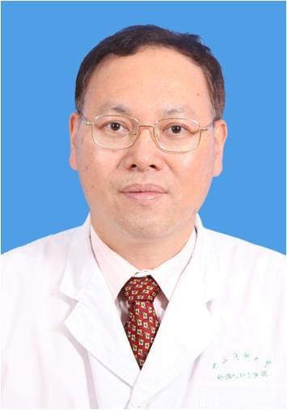

<!-- AUTO-GENERATED-BY: work/generate_obsidian_profiles.py -->

<!-- TEMPLATE: D:\workspace\信息收集整理\医生画像仓库\模板\医生画像模板.md -->

# 张惠忠

## 基础信息

| 字段 | 内容 |
|---|---|
| 姓名 | 张惠忠 |
| 医院 | 中山大学孙逸仙纪念医院 |
| 科室 | 胸外科 |
| 职称/身份 | 教授, 主任医师 |
| 来源链接 | [官网原文](https://www.gzsys.org.cn/node/14841) |
| 采集日期 | 2026-08-13 |

## 简介/擅长

## 教育与进修经历

- 张惠忠教授毕业于中山医科大学，在我院胸外科工作30多年，一直专注于肺部肿瘤和食管肿瘤的临床治疗，精通各类肺部和食管疾病的微创和开放手术，在综合治疗肺癌和食癌方面具有深厚造诣，是我省著名的资深胸外科专家。

## 论文与学术产出

- 现为美国临床肿瘤协会（ASCO)会员，欧洲临床肿瘤协会(ESMO)会员，曾在国内外核心医学期刊上发表50多篇诊断和治疗肺癌和食管癌的学术论著。

## 可包装亮点

- 胸外科教授、主任医师、研究生导师、胸外科副主任。
- 他率先采用手术为主，结合化放疗、生物免疫、基因靶向和中医药等方法综合医治肺癌和食管癌，在临床上取得显著疗效，明显提高肺癌和食管癌患者的治愈率，受到患者广泛好评。
- 现为美国临床肿瘤协会（ASCO)会员，欧洲临床肿瘤协会(ESMO)会员，曾在国内外核心医学期刊上发表50多篇诊断和治疗肺癌和食管癌的学术论著。

## 重点疾病/人群标签

- 慢性病：
- 肿瘤：肿瘤、癌、瘤、放疗、靶向、肺癌、免疫
- 生殖疾病：
- 免疫/风湿：肿瘤、癌、瘤、放疗、靶向、肺癌、免疫
- 术后恢复/康复：
- 疑难重症：

## 证据摘录

> 只摘录官网公开信息中的短句或关键字段，不复制大段原文。

- 官网身份字段：教授, 主任医师
- 官网亮眼经历线索：胸外科教授、主任医师、研究生导师、胸外科副主任。 他率先采用手术为主，结合化放疗、生物免疫、基因靶向和中医药等方法综合医治肺癌和食管癌，在临床上取得显著疗效，明显提高肺癌和食管癌患者的治愈率，受到患者广泛好评。 现为美国临床肿瘤协会（ASCO)会员，欧洲临床肿瘤协会(ESMO)会员，曾在国内外核心医学期刊上发表50多篇诊断和治疗肺癌和食管癌的学术论著。
- 来源链接：https://www.gzsys.org.cn/node/14841

## BD 画像摘要

张惠忠医生可作为肿瘤、免疫/风湿/感染方向的基础画像候选。后续 BD 使用应继续以官网来源和人工复核为准，不添加疗效承诺或无来源包装。

## 合规边界

- 仅使用医院官网、官方公众号、官方小程序等公开渠道。
- 不采集私人电话、私人微信、家庭住址、患者隐私或非公开排班信息。
- 不写“保证治愈”“疗效第一”“包治疑难杂症”等无法由官网证明的表述。
