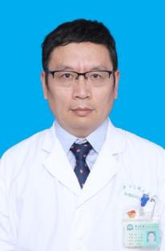

<!-- AUTO-GENERATED-BY: work/generate_obsidian_profiles.py -->

<!-- TEMPLATE: D:\workspace\信息收集整理\医生画像仓库\模板\医生画像模板.md -->

# 张杰

## 基础信息

| 字段 | 内容 |
|---|---|
| 姓名 | 张杰 |
| 医院 | 中山大学孙逸仙纪念医院 |
| 科室 | 小儿外科 |
| 职称/身份 | 副主任医师 |
| 来源链接 | [官网原文](https://www.gzsys.org.cn/node/15351) |
| 采集日期 | 2026-08-13 |

## 简介/擅长

## 教育与进修经历

- 美国印第安纳大学医学院访问学者。

## 科研项目与成果

- 参与国自然及省部级科研基金10余项，获广东省科技进步奖二等奖一项及广东省科技进步奖三等奖一项。

## 论文与学术产出

- 发表SCI论文4篇，参与SCI论文发表10余篇。

## 可包装亮点

- 美国印第安纳大学医学院访问学者。
- 发表SCI论文4篇，参与SCI论文发表10余篇。
- 参与国自然及省部级科研基金10余项，获广东省科技进步奖二等奖一项及广东省科技进步奖三等奖一项。

## 重点疾病/人群标签

- 慢性病：
- 肿瘤：
- 生殖疾病：
- 免疫/风湿：
- 术后恢复/康复：
- 疑难重症：

## 证据摘录

> 只摘录官网公开信息中的短句或关键字段，不复制大段原文。

- 官网身份字段：副主任医师
- 官网亮眼经历线索：美国印第安纳大学医学院访问学者。 发表SCI论文4篇，参与SCI论文发表10余篇。 参与国自然及省部级科研基金10余项，获广东省科技进步奖二等奖一项及广东省科技进步奖三等奖一项。
- 来源链接：https://www.gzsys.org.cn/node/15351

## BD 画像摘要

张杰医生可作为中山大学孙逸仙纪念医院小儿外科的基础医生资料入库。当前重点方向以总底表标签为准，官网未展示的信息保持空白。

## 合规边界

- 仅使用医院官网、官方公众号、官方小程序等公开渠道。
- 不采集私人电话、私人微信、家庭住址、患者隐私或非公开排班信息。
- 不写“保证治愈”“疗效第一”“包治疑难杂症”等无法由官网证明的表述。
