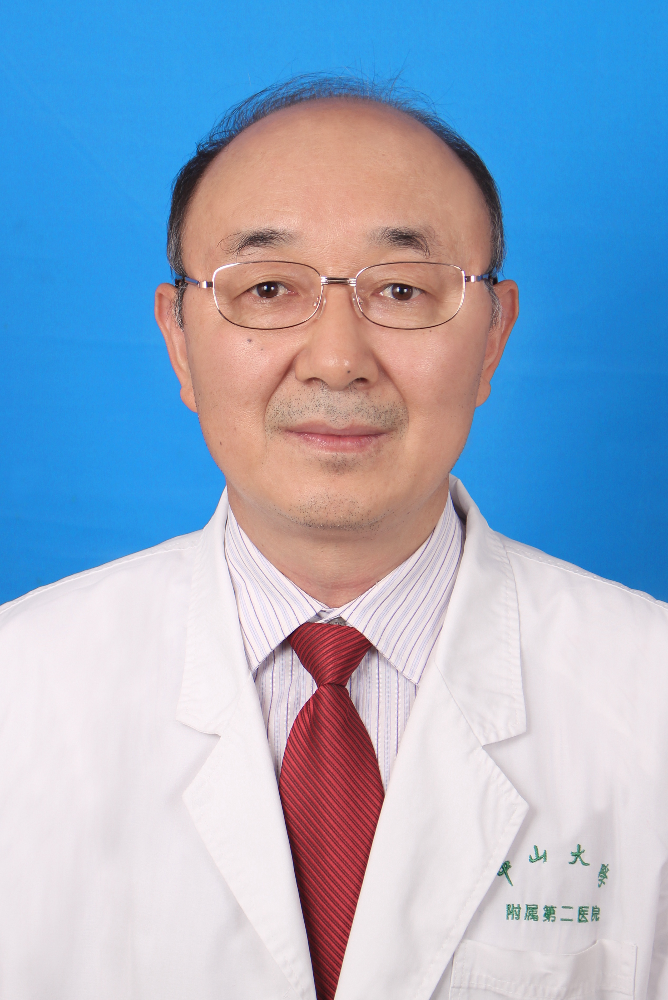

<!-- AUTO-GENERATED-BY: work/generate_obsidian_profiles.py -->

<!-- TEMPLATE: D:\workspace\信息收集整理\医生画像仓库\模板\医生画像模板.md -->

# 张清学

## 基础信息

| 字段 | 内容 |
|---|---|
| 姓名 | 张清学 |
| 医院 | 中山大学孙逸仙纪念医院 |
| 科室 | 妇科生殖内分泌专科 |
| 职称/身份 | 主任医师 |
| 来源链接 | [官网原文](https://www.gzsys.org.cn/node/15335) |
| 采集日期 | 2026-08-13 |

## 简介/擅长

## 教育与进修经历

- 1986年7月本科毕业于中山医科大学，一直在本院妇产科和生殖中心从事临床工作，曾先后到美国Stanford大学和加拿大McGill大学生殖中心学习辅助生殖技术。

## 科研项目与成果

- 主编或参加编写专著14部，发表学术论文180多篇，先后承担包括国家自然科学基金在内的科研项目20多项，获广东省和教育部科技成果奖多项，其中“人类辅助生殖技术临床应用和改良的系列研究”荣获2018年广东省科学技术奖科学技术进步三等奖。

## 论文与学术产出

- 主编或参加编写专著14部，发表学术论文180多篇，先后承担包括国家自然科学基金在内的科研项目20多项，获广东省和教育部科技成果奖多项，其中“人类辅助生殖技术临床应用和改良的系列研究”荣获2018年广东省科学技术奖科学技术进步三等奖。

## 可包装亮点

- 1986年7月本科毕业于中山医科大学，一直在本院妇产科和生殖中心从事临床工作，曾先后到美国Stanford大学和加拿大McGill大学生殖中心学习辅助生殖技术。
- 主编或参加编写专著14部，发表学术论文180多篇，先后承担包括国家自然科学基金在内的科研项目20多项，获广东省和教育部科技成果奖多项，其中“人类辅助生殖技术临床应用和改良的系列研究”荣获2018年广东省科学技术奖科学技术进步三等奖。
- 学术任职包括中华医学会生殖医学分会委员（第五届）、广东省医师协会生殖医学医师分会主任委员（第二届）、广东省医学会生殖医学分会副主任委员（第一、二、三届）、广东省临床医学学会生殖医学分会主任委员（第一届）、广东省医学会妇产科分会常务委员（第十二、三届）、广东省医学会妇产科分会生殖内分泌学组副组长（第十三届）、中国性学会生殖医学分会副主任委员（第二届）等。

## 重点疾病/人群标签

- 慢性病：
- 肿瘤：
- 生殖疾病：生殖、不孕、卵巢、辅助生殖、试管、多囊
- 免疫/风湿：
- 术后恢复/康复：
- 疑难重症：

## 证据摘录

> 只摘录官网公开信息中的短句或关键字段，不复制大段原文。

- 官网身份字段：主任医师
- 官网亮眼经历线索：1986年7月本科毕业于中山医科大学，一直在本院妇产科和生殖中心从事临床工作，曾先后到美国Stanford大学和加拿大McGill大学生殖中心学习辅助生殖技术。 主编或参加编写专著14部，发表学术论文180多篇，先后承担包括国家自然科学基金在内的科研项目20多项，获广东省和教育部科技成果奖多项，其中“人类辅助生殖技术临床应用和改良的系列研究”荣获2018年广东省科学技术奖科学技术进步三等奖。 学术任职包括中华医学会生殖医学分会委员（第…
- 来源链接：https://www.gzsys.org.cn/node/15335

## BD 画像摘要

张清学医生可作为生殖疾病方向的基础画像候选。后续 BD 使用应继续以官网来源和人工复核为准，不添加疗效承诺或无来源包装。

## 合规边界

- 仅使用医院官网、官方公众号、官方小程序等公开渠道。
- 不采集私人电话、私人微信、家庭住址、患者隐私或非公开排班信息。
- 不写“保证治愈”“疗效第一”“包治疑难杂症”等无法由官网证明的表述。
