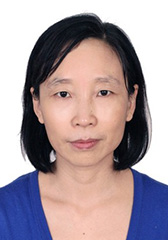

<!-- AUTO-GENERATED-BY: work/generate_obsidian_profiles.py -->

<!-- TEMPLATE: D:\workspace\信息收集整理\医生画像仓库\模板\医生画像模板.md -->

# 张玉玲

## 基础信息

| 字段 | 内容 |
|---|---|
| 姓名 | 张玉玲 |
| 医院 | 中山大学孙逸仙纪念医院 |
| 科室 | 心血管内科、医工融合中心 |
| 职称/身份 | 教授, 主任医师 |
| 来源链接 | [官网原文](https://www.gzsys.org.cn/node/14824) |
| 采集日期 | 2026-08-13 |

## 简介/擅长

## 教育与进修经历

- 现任中山大学孙逸仙纪念医院心血管内科主任医师，医院医工融合部主任及临床试验设计部副主任，心内科起搏与心电生理实验室主任，于美国宾夕法尼亚州Temple University国家教育部高级出国访问学者，主要研究方向为脂质代谢与动脉粥样硬化，心力衰竭心肌逆重构的病理机制研究，遗传性心血管疾病的基因诊断，担任国家自然基金评审专家，主持并完成国家自然基金、广东省自然科学基金多项，第一作者及通讯作者发表Redox Biology, Circulation Research, J of Biological Chemistr…

## 科研项目与成果

- 现任中山大学孙逸仙纪念医院心血管内科主任医师，医院医工融合部主任及临床试验设计部副主任，心内科起搏与心电生理实验室主任，于美国宾夕法尼亚州Temple University国家教育部高级出国访问学者，主要研究方向为脂质代谢与动脉粥样硬化，心力衰竭心肌逆重构的病理机制研究，遗传性心血管疾病的基因诊断，担任国家自然基金评审专家，主持并完成国家自然基金、广东省自然科学基金多项，第一作者及通讯作者发表Redox Biology, Circulation Research, J of Biological Chemistr…

## 论文与学术产出

- 现任中山大学孙逸仙纪念医院心血管内科主任医师，医院医工融合部主任及临床试验设计部副主任，心内科起搏与心电生理实验室主任，于美国宾夕法尼亚州Temple University国家教育部高级出国访问学者，主要研究方向为脂质代谢与动脉粥样硬化，心力衰竭心肌逆重构的病理机制研究，遗传性心血管疾病的基因诊断，担任国家自然基金评审专家，主持并完成国家自然基金、广东省自然科学基金多项，第一作者及通讯作者发表Redox Biology, Circulation Research, J of Biological Chemistr…

## 可包装亮点

- 从事心血管内科工作30余年，被评为广州实力中青年医师，长期致力于心力衰竭、冠心病、血脂异常、遗传性心血管疾病等疾病的诊断与治疗，尤其在心力衰竭、心血管疾病急危重症、血脂异常的诊治方面有丰富的临床经验。
- 现任中山大学孙逸仙纪念医院心血管内科主任医师，医院医工融合部主任及临床试验设计部副主任，心内科起搏与心电生理实验室主任，于美国宾夕法尼亚州Temple University国家教育部高级出国访问学者，主要研究方向为脂质代谢与动脉粥样硬化，心力衰竭心肌逆重构的病理机制研究，遗传性心血管疾病的基因诊断，担任国家自然基金评审专家，主持并完成国家自然基金、广东省自…

## 重点疾病/人群标签

- 慢性病：冠心病、心力衰竭、动脉粥样硬化、代谢、重症、急危重
- 肿瘤：
- 生殖疾病：
- 免疫/风湿：
- 术后恢复/康复：
- 疑难重症：冠心病、心力衰竭、动脉粥样硬化、代谢、重症、急危重

## 证据摘录

> 只摘录官网公开信息中的短句或关键字段，不复制大段原文。

- 官网身份字段：教授, 主任医师
- 官网亮眼经历线索：从事心血管内科工作30余年，被评为广州实力中青年医师，长期致力于心力衰竭、冠心病、血脂异常、遗传性心血管疾病等疾病的诊断与治疗，尤其在心力衰竭、心血管疾病急危重症、血脂异常的诊治方面有丰富的临床经验。 现任中山大学孙逸仙纪念医院心血管内科主任医师，医院医工融合部主任及临床试验设计部副主任，心内科起搏与心电生理实验室主任，于美国宾夕法尼亚州Temple University国家教育部高级出国访问学者，主要研究方向为脂质代谢与动脉粥样硬化…
- 来源链接：https://www.gzsys.org.cn/node/14824

## BD 画像摘要

张玉玲医生可作为慢性病、疑难重症方向的基础画像候选。后续 BD 使用应继续以官网来源和人工复核为准，不添加疗效承诺或无来源包装。

## 合规边界

- 仅使用医院官网、官方公众号、官方小程序等公开渠道。
- 不采集私人电话、私人微信、家庭住址、患者隐私或非公开排班信息。
- 不写“保证治愈”“疗效第一”“包治疑难杂症”等无法由官网证明的表述。
