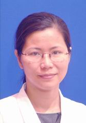

<!-- AUTO-GENERATED-BY: work/generate_obsidian_profiles.py -->

<!-- TEMPLATE: D:\workspace\信息收集整理\医生画像仓库\模板\医生画像模板.md -->

# 张睿

## 基础信息

| 字段 | 内容 |
|---|---|
| 姓名 | 张睿 |
| 医院 | 中山大学孙逸仙纪念医院 |
| 科室 | 围产专科 |
| 职称/身份 | 副主任医师 |
| 来源链接 | [官网原文](https://www.gzsys.org.cn/node/14572) |
| 采集日期 | 2026-08-13 |

## 简介/擅长

## 可包装亮点

- 对产科疑难重症的诊治、胎儿医学、产科手术有丰富经验。
- 中山大学孙逸仙纪念医院产科副主任，广东省免疫学会生殖免疫分会常务委员，广东省医学会妇幼保健分会委员，广东省妇幼保健协会产前诊断分会委员，广东省产前诊断技术专家库成员，广东省保健协会生殖健康分会委员，广东省基层医药学会围产专业委员会常务委员，广东省健康教育协会妇产科健康专业委员会常务委员

## 重点疾病/人群标签

- 慢性病：
- 肿瘤：
- 生殖疾病：生殖、免疫、疑难、重症
- 免疫/风湿：生殖、免疫、疑难、重症
- 术后恢复/康复：
- 疑难重症：生殖、免疫、疑难、重症

## 证据摘录

> 只摘录官网公开信息中的短句或关键字段，不复制大段原文。

- 官网身份字段：副主任医师
- 官网亮眼经历线索：对产科疑难重症的诊治、胎儿医学、产科手术有丰富经验。 中山大学孙逸仙纪念医院产科副主任，广东省免疫学会生殖免疫分会常务委员，广东省医学会妇幼保健分会委员，广东省妇幼保健协会产前诊断分会委员，广东省产前诊断技术专家库成员，广东省保健协会生殖健康分会委员，广东省基层医药学会围产专业委员会常务委员，广东省健康教育协会妇产科健康专业委员会常务委员
- 来源链接：https://www.gzsys.org.cn/node/14572

## BD 画像摘要

张睿医生可作为生殖疾病、免疫/风湿/感染、疑难重症方向的基础画像候选。后续 BD 使用应继续以官网来源和人工复核为准，不添加疗效承诺或无来源包装。

## 合规边界

- 仅使用医院官网、官方公众号、官方小程序等公开渠道。
- 不采集私人电话、私人微信、家庭住址、患者隐私或非公开排班信息。
- 不写“保证治愈”“疗效第一”“包治疑难杂症”等无法由官网证明的表述。
