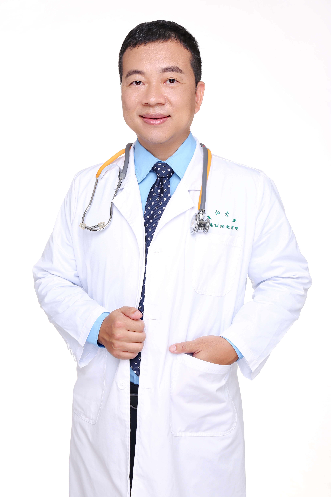

<!-- AUTO-GENERATED-BY: work/generate_obsidian_profiles.py -->

<!-- TEMPLATE: D:\workspace\信息收集整理\医生画像仓库\模板\医生画像模板.md -->

# 张磊

## 基础信息

| 字段 | 内容 |
|---|---|
| 姓名 | 张磊 |
| 医院 | 中山大学孙逸仙纪念医院 |
| 科室 | 肝胆外科 |
| 职称/身份 | 主任医师 |
| 来源链接 | [官网原文](https://www.gzsys.org.cn/node/15243) |
| 采集日期 | 2026-08-13 |

## 简介/擅长

## 论文与学术产出

- 德国医学博士 中国医师协会快速康复外科委员会委员 中国医师协会肝癌专业委员会委员 中国医师协会胆道外科委员会委员 国际肝胆胰协会中国分会快速康复委员会委员兼秘书 广东医学会外科分会常务委员 广东医学会微创学会常务委员 广东医学会肝胆胰分会胰腺学组副组长 《岭南现代临床外科》副主编，编辑部主任 首届广东“实力中青年医生” 从事肝胆外科20余年，擅长各类微创腔镜手术，对消化道肿瘤的诊治有较深的造诣，尤其擅长肝癌、胆囊癌、胆囊结石、 息肉的诊治和精准治疗。

## 可包装亮点

- 德国医学博士 中国医师协会快速康复外科委员会委员 中国医师协会肝癌专业委员会委员 中国医师协会胆道外科委员会委员 国际肝胆胰协会中国分会快速康复委员会委员兼秘书 广东医学会外科分会常务委员 广东医学会微创学会常务委员 广东医学会肝胆胰分会胰腺学组副组长 《岭南现代临床外科》副主编，编辑部主任 首届广东“实力中青年医生” 从事肝胆外科20余年，擅长各类微创腔…
- 曾获广东省科技进步二等奖，中华医学奖三等奖，医师报2019年“十大医学促进专家”

## 重点疾病/人群标签

- 慢性病：
- 肿瘤：肿瘤、癌、肝癌、康复
- 生殖疾病：
- 免疫/风湿：
- 术后恢复/康复：肿瘤、癌、肝癌、康复
- 疑难重症：

## 证据摘录

> 只摘录官网公开信息中的短句或关键字段，不复制大段原文。

- 官网身份字段：主任医师
- 官网亮眼经历线索：德国医学博士 中国医师协会快速康复外科委员会委员 中国医师协会肝癌专业委员会委员 中国医师协会胆道外科委员会委员 国际肝胆胰协会中国分会快速康复委员会委员兼秘书 广东医学会外科分会常务委员 广东医学会微创学会常务委员 广东医学会肝胆胰分会胰腺学组副组长 《岭南现代临床外科》副主编，编辑部主任 首届广东“实力中青年医生” 从事肝胆外科20余年，擅长各类微创腔镜手术，对消化道肿瘤的诊治有较深的造诣，尤其擅长肝癌、胆囊癌、胆囊结石、 息肉的…
- 来源链接：https://www.gzsys.org.cn/node/15243

## BD 画像摘要

张磊医生可作为肿瘤、术后恢复/康复方向的基础画像候选。后续 BD 使用应继续以官网来源和人工复核为准，不添加疗效承诺或无来源包装。

## 合规边界

- 仅使用医院官网、官方公众号、官方小程序等公开渠道。
- 不采集私人电话、私人微信、家庭住址、患者隐私或非公开排班信息。
- 不写“保证治愈”“疗效第一”“包治疑难杂症”等无法由官网证明的表述。
