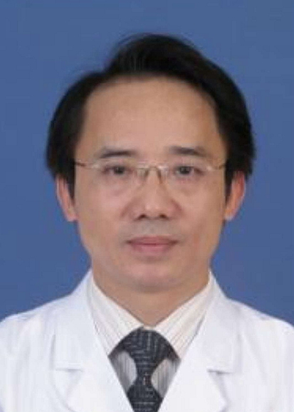

<!-- AUTO-GENERATED-BY: work/generate_obsidian_profiles.py -->

<!-- TEMPLATE: D:\workspace\信息收集整理\医生画像仓库\模板\医生画像模板.md -->

# 张立伐

## 基础信息

| 字段 | 内容 |
|---|---|
| 姓名 | 张立伐 |
| 医院 | 中山大学孙逸仙纪念医院 |
| 科室 | 急诊科 |
| 职称/身份 | 主任医师 |
| 来源链接 | [官网原文](https://www.gzsys.org.cn/doctor/14725) |
| 采集日期 | 2026-08-13 |

## 简介/擅长

## 教育与进修经历

- 中山医科大学博士研究生毕业，日本大阪大学及日本国立微生物病研究所博士后工作两年。

## 论文与学术产出

- 参编国家规划教材《传染病学》（五年制第6版）。

## 可包装亮点

- 主任医师，医学博士。
- 历任中山二院感染科主任、广东省感染病医师分会副主委、广东省中西医肝病分会副主委、中国感染病医师学会委员等职。

## 重点疾病/人群标签

- 慢性病：
- 肿瘤：
- 生殖疾病：
- 免疫/风湿：感染
- 术后恢复/康复：
- 疑难重症：

## 证据摘录

> 只摘录官网公开信息中的短句或关键字段，不复制大段原文。

- 官网身份字段：主任医师
- 官网亮眼经历线索：主任医师，医学博士。 历任中山二院感染科主任、广东省感染病医师分会副主委、广东省中西医肝病分会副主委、中国感染病医师学会委员等职。
- 来源链接：https://www.gzsys.org.cn/doctor/14725

## BD 画像摘要

张立伐医生可作为免疫/风湿/感染方向的基础画像候选。后续 BD 使用应继续以官网来源和人工复核为准，不添加疗效承诺或无来源包装。

## 合规边界

- 仅使用医院官网、官方公众号、官方小程序等公开渠道。
- 不采集私人电话、私人微信、家庭住址、患者隐私或非公开排班信息。
- 不写“保证治愈”“疗效第一”“包治疑难杂症”等无法由官网证明的表述。
