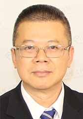

<!-- AUTO-GENERATED-BY: work/generate_obsidian_profiles.py -->

<!-- TEMPLATE: D:\workspace\信息收集整理\医生画像仓库\模板\医生画像模板.md -->

# 张金明

## 基础信息

| 字段 | 内容 |
|---|---|
| 姓名 | 张金明 |
| 医院 | 中山大学孙逸仙纪念医院 |
| 科室 | 整形外科 |
| 职称/身份 | 教授, 主任医师 |
| 来源链接 | [官网原文](https://www.gzsys.org.cn/node/15203) |
| 采集日期 | 2026-08-13 |

## 简介/擅长

## 科研项目与成果

- 近20多年来，整形外科承担多项省、部级科研课题，在美容整形、创面修复、尿道下裂、疤痕和干细胞等方面有深入的研究。
- 张金明教授为本院整形外科创始人，经过近20年的努力，本院整形外科取得了丰硕成果。
- 曾获国家、部、省厅、校级课题多项。

## 论文与学术产出

- 在国内外期刊上以通讯作者或第一作者发表专业论文40余篇。

## 可包装亮点

- 在国内外期刊上以通讯作者或第一作者发表专业论文40余篇。

## 重点疾病/人群标签

- 慢性病：
- 肿瘤：肿瘤、生殖、术后、创面
- 生殖疾病：肿瘤、生殖、术后、创面
- 免疫/风湿：
- 术后恢复/康复：肿瘤、生殖、术后、创面
- 疑难重症：

## 证据摘录

> 只摘录官网公开信息中的短句或关键字段，不复制大段原文。

- 官网身份字段：教授, 主任医师
- 官网亮眼经历线索：在国内外期刊上以通讯作者或第一作者发表专业论文40余篇。
- 来源链接：https://www.gzsys.org.cn/node/15203

## BD 画像摘要

张金明医生可作为肿瘤、生殖疾病、术后恢复/康复方向的基础画像候选。后续 BD 使用应继续以官网来源和人工复核为准，不添加疗效承诺或无来源包装。

## 合规边界

- 仅使用医院官网、官方公众号、官方小程序等公开渠道。
- 不采集私人电话、私人微信、家庭住址、患者隐私或非公开排班信息。
- 不写“保证治愈”“疗效第一”“包治疑难杂症”等无法由官网证明的表述。
