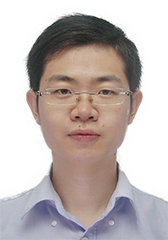

<!-- AUTO-GENERATED-BY: work/generate_obsidian_profiles.py -->

<!-- TEMPLATE: D:\workspace\信息收集整理\医生画像仓库\模板\医生画像模板.md -->

# 张锐

## 基础信息

| 字段 | 内容 |
|---|---|
| 姓名 | 张锐 |
| 医院 | 中山大学孙逸仙纪念医院 |
| 科室 | 胆胰外科 |
| 职称/身份 | 主任医师 |
| 来源链接 | [官网原文](https://www.gzsys.org.cn/node/15209) |
| 采集日期 | 2026-08-13 |

## 简介/擅长

## 教育与进修经历

- 硕士毕业于中山大学，博士毕业于德国杜伊斯堡-埃森大学医学院（西德肿瘤中心）。

## 科研项目与成果

- 国家自然科学基金和广东省自然科学基金评审专家。
- 主持2项国家自然科学基金项目，3项广东省自然科学基金项目、广东省科技基金项目；
- 1项高校青年教师培育项目，1项国家大学生创新训练项目。

## 论文与学术产出

- 目前以第一/通讯作者在《International journal of cancer》、 《Oncogenesis》、 《Signal Transduction and Targeted Therapy》等国际著名期刊发表SCI论文10余篇（单篇最高影响因子13.5，累计影响因子大于70）；

## 可包装亮点

- 德国医学博士，硕士生导师，胆胰外科主任医师。
- 硕士毕业于中山大学，博士毕业于德国杜伊斯堡-埃森大学医学院（西德肿瘤中心）。
- 目前以第一/通讯作者在《International journal of cancer》、 《Oncogenesis》、 《Signal Transduction and Targeted Therapy》等国际著名期刊发表SCI论文10余篇（单篇最高影响因子13.5，累计影响因子大于70）；
- 国家自然科学基金和广东省自然科学基金评审专家。

## 重点疾病/人群标签

- 慢性病：
- 肿瘤：肿瘤
- 生殖疾病：
- 免疫/风湿：
- 术后恢复/康复：
- 疑难重症：

## 证据摘录

> 只摘录官网公开信息中的短句或关键字段，不复制大段原文。

- 官网身份字段：主任医师
- 官网亮眼经历线索：德国医学博士，硕士生导师，胆胰外科主任医师。 硕士毕业于中山大学，博士毕业于德国杜伊斯堡-埃森大学医学院（西德肿瘤中心）。 目前以第一/通讯作者在《International journal of cancer》、 《Oncogenesis》、 《Signal Transduction and Targeted Therapy》等国际著名期刊发表SCI论文10余篇（单篇最高影响因子13.5，累计影响因子大于70）； 国家自然科学基金和…
- 来源链接：https://www.gzsys.org.cn/node/15209

## BD 画像摘要

张锐医生可作为肿瘤方向的基础画像候选。后续 BD 使用应继续以官网来源和人工复核为准，不添加疗效承诺或无来源包装。

## 合规边界

- 仅使用医院官网、官方公众号、官方小程序等公开渠道。
- 不采集私人电话、私人微信、家庭住址、患者隐私或非公开排班信息。
- 不写“保证治愈”“疗效第一”“包治疑难杂症”等无法由官网证明的表述。
