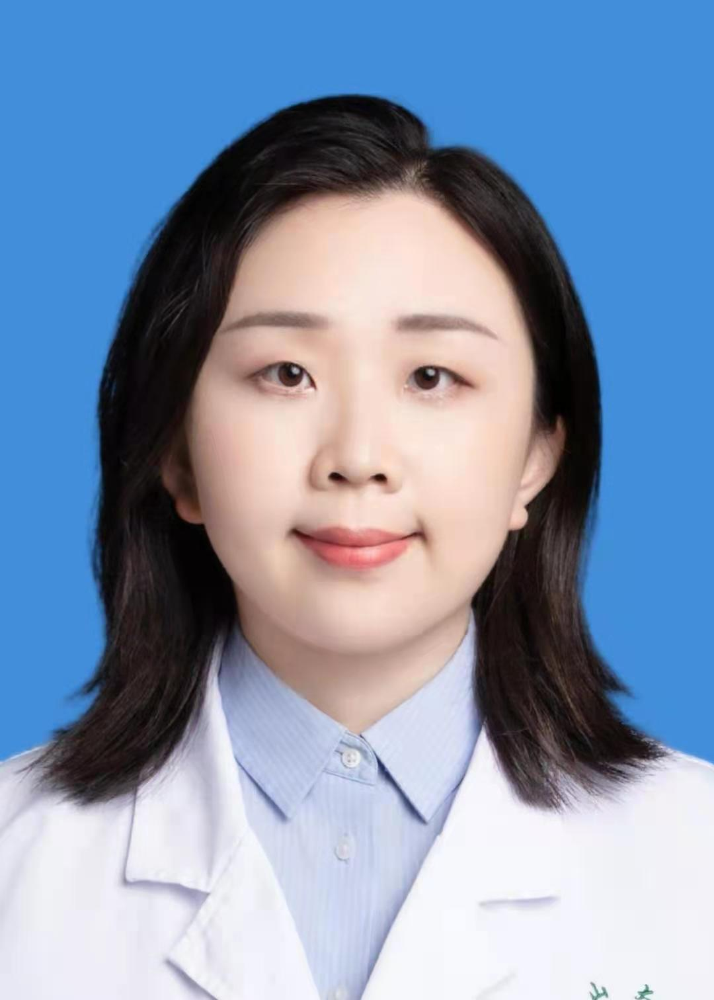

<!-- AUTO-GENERATED-BY: work/generate_obsidian_profiles.py -->

<!-- TEMPLATE: D:\workspace\信息收集整理\医生画像仓库\模板\医生画像模板.md -->

# 张静

## 基础信息

| 字段 | 内容 |
|---|---|
| 姓名 | 张静 |
| 医院 | 中山大学孙逸仙纪念医院 |
| 科室 | 皮肤科 |
| 职称/身份 | 副主任医师 |
| 来源链接 | [官网原文](https://www.gzsys.org.cn/node/15391) |
| 采集日期 | 2026-08-13 |

## 简介/擅长

## 教育与进修经历

- 临床医学博士，美国乔治城大学访问学者。

## 科研项目与成果

- 主持国家自然科学基金及其他省部级基金，发表国内外论著30余篇。

## 论文与学术产出

- 主持国家自然科学基金及其他省部级基金，发表国内外论著30余篇。

## 可包装亮点

- 临床医学博士，美国乔治城大学访问学者。
- 主持国家自然科学基金及其他省部级基金，发表国内外论著30余篇。
- 担任广东省医师协会皮肤科医师分会青年委员，广东省医学会真菌学组委员，广东省整形美容协会皮肤美容分会委员。

## 重点疾病/人群标签

- 慢性病：
- 肿瘤：
- 生殖疾病：
- 免疫/风湿：感染
- 术后恢复/康复：
- 疑难重症：

## 证据摘录

> 只摘录官网公开信息中的短句或关键字段，不复制大段原文。

- 官网身份字段：副主任医师
- 官网亮眼经历线索：临床医学博士，美国乔治城大学访问学者。 主持国家自然科学基金及其他省部级基金，发表国内外论著30余篇。 担任广东省医师协会皮肤科医师分会青年委员，广东省医学会真菌学组委员，广东省整形美容协会皮肤美容分会委员。
- 来源链接：https://www.gzsys.org.cn/node/15391

## BD 画像摘要

张静医生可作为免疫/风湿/感染方向的基础画像候选。后续 BD 使用应继续以官网来源和人工复核为准，不添加疗效承诺或无来源包装。

## 合规边界

- 仅使用医院官网、官方公众号、官方小程序等公开渠道。
- 不采集私人电话、私人微信、家庭住址、患者隐私或非公开排班信息。
- 不写“保证治愈”“疗效第一”“包治疑难杂症”等无法由官网证明的表述。
