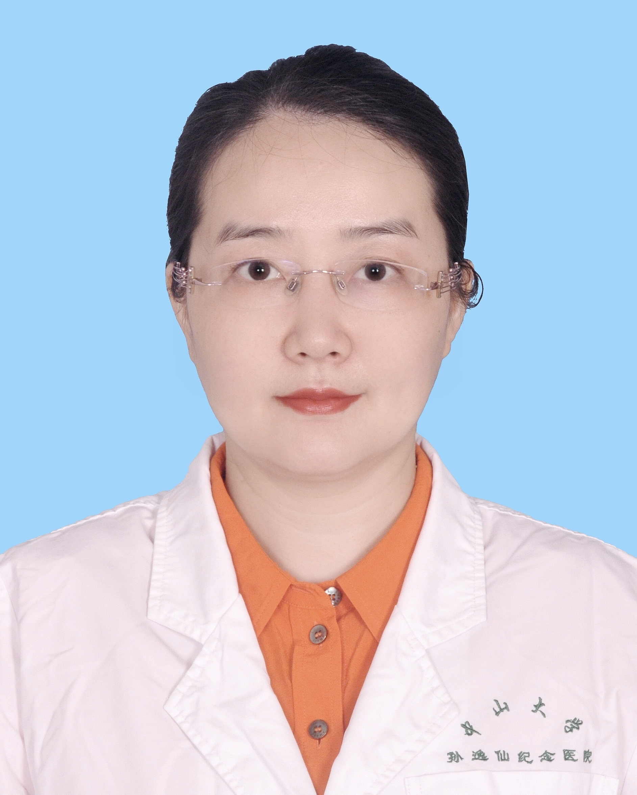

<!-- AUTO-GENERATED-BY: work/generate_obsidian_profiles.py -->

<!-- TEMPLATE: D:\workspace\信息收集整理\医生画像仓库\模板\医生画像模板.md -->

# 张黎黎

## 基础信息

| 字段 | 内容 |
|---|---|
| 姓名 | 张黎黎 |
| 医院 | 中山大学孙逸仙纪念医院 |
| 科室 | 肾内科 |
| 职称/身份 | 主治医师 |
| 来源链接 | [官网原文](https://www.gzsys.org.cn/doctor/15376) |
| 采集日期 | 2026-08-13 |

## 简介/擅长

## 教育与进修经历

- 硕博连读毕业于中山大学肾内科专业，长期从事肾内科临床、教学及科研工作。

## 科研项目与成果

- 硕博连读毕业于中山大学肾内科专业，长期从事肾内科临床、教学及科研工作。
- 参与省级科研基金2项，发表SCI学术论文5篇，中文核心期刊2篇。

## 论文与学术产出

- 参与省级科研基金2项，发表SCI学术论文5篇，中文核心期刊2篇。

## 可包装亮点

- 担任广东省中西医结合学会血液净化专业委员会委员、广东省医疗行业协会肾内科管理委员会委。
- 参与省级科研基金2项，发表SCI学术论文5篇，中文核心期刊2篇。

## 重点疾病/人群标签

- 慢性病：慢性、感染
- 肿瘤：
- 生殖疾病：
- 免疫/风湿：慢性、感染
- 术后恢复/康复：
- 疑难重症：

## 证据摘录

> 只摘录官网公开信息中的短句或关键字段，不复制大段原文。

- 官网身份字段：主治医师
- 官网亮眼经历线索：担任广东省中西医结合学会血液净化专业委员会委员、广东省医疗行业协会肾内科管理委员会委。 参与省级科研基金2项，发表SCI学术论文5篇，中文核心期刊2篇。
- 来源链接：https://www.gzsys.org.cn/doctor/15376

## BD 画像摘要

张黎黎医生可作为慢性病、免疫/风湿/感染方向的基础画像候选。后续 BD 使用应继续以官网来源和人工复核为准，不添加疗效承诺或无来源包装。

## 合规边界

- 仅使用医院官网、官方公众号、官方小程序等公开渠道。
- 不采集私人电话、私人微信、家庭住址、患者隐私或非公开排班信息。
- 不写“保证治愈”“疗效第一”“包治疑难杂症”等无法由官网证明的表述。
