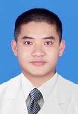

<!-- AUTO-GENERATED-BY: work/generate_obsidian_profiles.py -->

<!-- TEMPLATE: D:\workspace\信息收集整理\医生画像仓库\模板\医生画像模板.md -->

# 彭耀荣

## 基础信息

| 字段 | 内容 |
|---|---|
| 姓名 | 彭耀荣 |
| 医院 | 中山大学孙逸仙纪念医院 |
| 科室 | 胆胰外科 |
| 职称/身份 | 副主任医师 |
| 来源链接 | [官网原文](https://www.gzsys.org.cn/doctor/15386) |
| 采集日期 | 2026-08-13 |

## 简介/擅长

## 科研项目与成果

- 参与国家级研究课题2项，省级科研课题2项，以第一作者发表SCI文章4篇，国内核心期刊发表文章多篇。

## 论文与学术产出

- 参与国家级研究课题2项，省级科研课题2项，以第一作者发表SCI文章4篇，国内核心期刊发表文章多篇。

## 可包装亮点

- 中国医师协会广东省分会ERAS分会 青年委员 广东省抗癌协会胰腺癌分会青年委员 中国国际医学交流促进会胰腺分会青年委员 广东省中西医结合学会普通外科委员会青年委员 擅长于胆胰外科各种常见疾病的如肝癌、胆管癌、胆囊癌、胰腺癌等消化道肿瘤及胆石症、胆囊息肉、门脉高压症、急慢性胆囊炎及胆管炎、急慢性胰腺炎等良性疾病的诊断和治疗。
- 参与国家级研究课题2项，省级科研课题2项，以第一作者发表SCI文章4篇，国内核心期刊发表文章多篇。

## 重点疾病/人群标签

- 慢性病：慢性、肿瘤、癌、肝癌
- 肿瘤：慢性、肿瘤、癌、肝癌
- 生殖疾病：
- 免疫/风湿：
- 术后恢复/康复：
- 疑难重症：

## 证据摘录

> 只摘录官网公开信息中的短句或关键字段，不复制大段原文。

- 官网身份字段：副主任医师
- 官网亮眼经历线索：中国医师协会广东省分会ERAS分会 青年委员 广东省抗癌协会胰腺癌分会青年委员 中国国际医学交流促进会胰腺分会青年委员 广东省中西医结合学会普通外科委员会青年委员 擅长于胆胰外科各种常见疾病的如肝癌、胆管癌、胆囊癌、胰腺癌等消化道肿瘤及胆石症、胆囊息肉、门脉高压症、急慢性胆囊炎及胆管炎、急慢性胰腺炎等良性疾病的诊断和治疗。 参与国家级研究课题2项，省级科研课题2项，以第一作者发表SCI文章4篇，国内核心期刊发表文章多篇。
- 来源链接：https://www.gzsys.org.cn/doctor/15386

## BD 画像摘要

彭耀荣医生可作为慢性病、肿瘤方向的基础画像候选。后续 BD 使用应继续以官网来源和人工复核为准，不添加疗效承诺或无来源包装。

## 合规边界

- 仅使用医院官网、官方公众号、官方小程序等公开渠道。
- 不采集私人电话、私人微信、家庭住址、患者隐私或非公开排班信息。
- 不写“保证治愈”“疗效第一”“包治疑难杂症”等无法由官网证明的表述。
