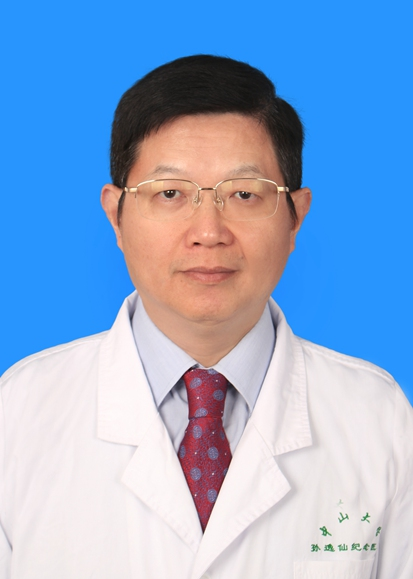

<!-- AUTO-GENERATED-BY: work/generate_obsidian_profiles.py -->

<!-- TEMPLATE: D:\workspace\信息收集整理\医生画像仓库\模板\医生画像模板.md -->

# 徐安平

## 基础信息

| 字段 | 内容 |
|---|---|
| 姓名 | 徐安平 |
| 医院 | 中山大学孙逸仙纪念医院 |
| 科室 | 肾内科 |
| 职称/身份 | 教授, 主任医师 |
| 来源链接 | [官网原文](https://www.gzsys.org.cn/node/14673) |
| 采集日期 | 2026-08-13 |

## 简介/擅长

## 教育与进修经历

- 教授，主任医师，博士生导师，博士后合作导师。
- 华夏医学科技奖终审专家，国家自然科学基金和广东省基金评审专家，广东、江苏等多省科技奖及教育部学位中心论文评审专家。
- 已指导博士生、硕士生和博士后40余人，在国内外发表专业论文70余篇（其中SCI论文38篇，1篇1% ESI高被引论文），主持国家自然科学基金等十多项科研基金研究，获广东省科技奖1项。

## 科研项目与成果

- 华夏医学科技奖终审专家，国家自然科学基金和广东省基金评审专家，广东、江苏等多省科技奖及教育部学位中心论文评审专家。
- 已指导博士生、硕士生和博士后40余人，在国内外发表专业论文70余篇（其中SCI论文38篇，1篇1% ESI高被引论文），主持国家自然科学基金等十多项科研基金研究，获广东省科技奖1项。

## 论文与学术产出

- 华夏医学科技奖终审专家，国家自然科学基金和广东省基金评审专家，广东、江苏等多省科技奖及教育部学位中心论文评审专家。
- 已指导博士生、硕士生和博士后40余人，在国内外发表专业论文70余篇（其中SCI论文38篇，1篇1% ESI高被引论文），主持国家自然科学基金等十多项科研基金研究，获广东省科技奖1项。

## 可包装亮点

- 教授，主任医师，博士生导师，博士后合作导师。
- 2005年3月至2020年7月任肾内科主任。
- 华夏医学科技奖终审专家，国家自然科学基金和广东省基金评审专家，广东、江苏等多省科技奖及教育部学位中心论文评审专家。
- 中国医促进会血液净化与工程技术分会委员，中国卫生信息与健康医疗大数据学会肾脏病专委会常委，广东省医学会肾脏病学分会常委，广东省医院协会血液净化专委会副主委，广东省肾脏内科医师分会常委，广东省血液净化质控中心专家组副组长，广东省生物医学工程学会血液净化专委会副主委，广东省医学教育协会肾脏病学分会副主委，中山大学卫生系列晋升正高级资格考核专家，广东省和广州市卫…

## 重点疾病/人群标签

- 慢性病：高血压、糖尿病、慢性、感染
- 肿瘤：
- 生殖疾病：
- 免疫/风湿：高血压、糖尿病、慢性、感染
- 术后恢复/康复：
- 疑难重症：

## 证据摘录

> 只摘录官网公开信息中的短句或关键字段，不复制大段原文。

- 官网身份字段：教授, 主任医师
- 官网亮眼经历线索：教授，主任医师，博士生导师，博士后合作导师。 2005年3月至2020年7月任肾内科主任。 华夏医学科技奖终审专家，国家自然科学基金和广东省基金评审专家，广东、江苏等多省科技奖及教育部学位中心论文评审专家。 中国医促进会血液净化与工程技术分会委员，中国卫生信息与健康医疗大数据学会肾脏病专委会常委，广东省医学会肾脏病学分会常委，广东省医院协会血液净化专委会副主委，广东省肾脏内科医师分会常委，广东省血液净化质控中心专家组副组长，广东省生物…
- 来源链接：https://www.gzsys.org.cn/node/14673

## BD 画像摘要

徐安平医生可作为慢性病、免疫/风湿/感染方向的基础画像候选。后续 BD 使用应继续以官网来源和人工复核为准，不添加疗效承诺或无来源包装。

## 合规边界

- 仅使用医院官网、官方公众号、官方小程序等公开渠道。
- 不采集私人电话、私人微信、家庭住址、患者隐私或非公开排班信息。
- 不写“保证治愈”“疗效第一”“包治疑难杂症”等无法由官网证明的表述。
