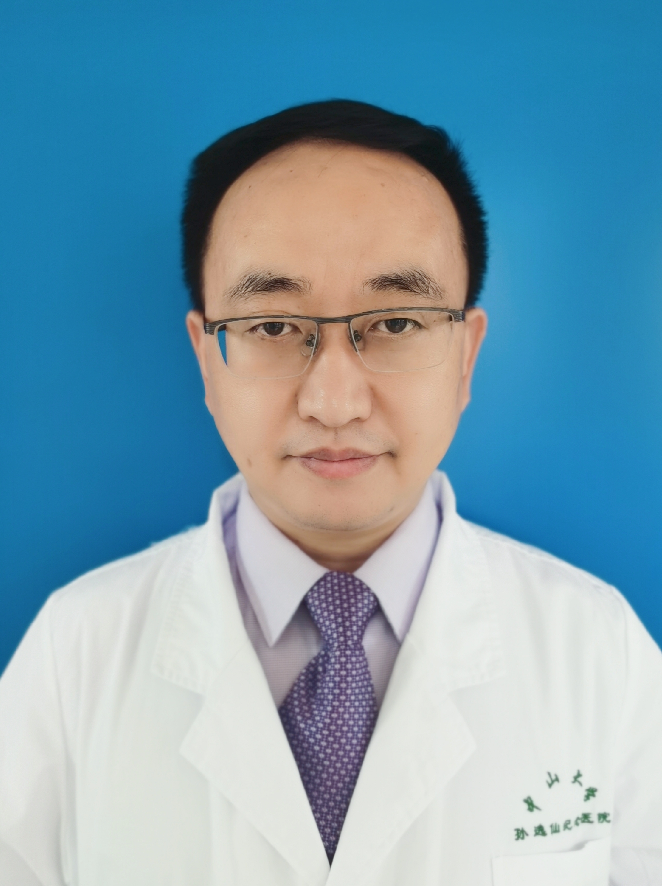

<!-- AUTO-GENERATED-BY: work/generate_obsidian_profiles.py -->

<!-- TEMPLATE: D:\workspace\信息收集整理\医生画像仓库\模板\医生画像模板.md -->

# 徐宏贵

## 基础信息

| 字段 | 内容 |
|---|---|
| 姓名 | 徐宏贵 |
| 医院 | 中山大学孙逸仙纪念医院 |
| 科室 | 儿科血液专科 |
| 职称/身份 | 主任医师, 副教授 |
| 来源链接 | [官网原文](https://www.gzsys.org.cn/doctor/14683) |
| 采集日期 | 2026-08-13 |

## 简介/擅长

## 教育与进修经历

- 获评“广州最具实力中青年医师”（2019年）和“广东省住院医师规范化培训优秀指导老师”（2020年）称号。

## 科研项目与成果

- 主持国家自然科学基金与广东省自然科学基金2项，参与多项国家级与省部级科研基金项目的研究工作。

## 论文与学术产出

- 先后在专业核心期刊发表论文30余篇，参编专著3本，副主编《实用小儿血液病学》1本。

## 可包装亮点

- 广东省医学会儿科分会血液学组委员，广东省抗癌协会小儿专委会委员，广东优生优育协会地中海贫血专家委员会委员，广东省地中海贫血协会常务理事，广东省生物医学工程学会血液血管分会常务委员，广东省妇幼保健协会脐带血应用专业委员会委员。
- 主持国家自然科学基金与广东省自然科学基金2项，参与多项国家级与省部级科研基金项目的研究工作。
- 《脐血造血干细胞移植的基础与临床系列研究》分获教育部科技进步一等奖和广东省科技进步二等奖，《儿童造血干细胞移植GVHD的基础与临床研究》获广东省科技进步三等奖。
- 先后在专业核心期刊发表论文30余篇，参编专著3本，副主编《实用小儿血液病学》1本。

## 重点疾病/人群标签

- 慢性病：慢性、癌、白血病、免疫
- 肿瘤：慢性、癌、白血病、免疫
- 生殖疾病：
- 免疫/风湿：慢性、癌、白血病、免疫
- 术后恢复/康复：
- 疑难重症：

## 证据摘录

> 只摘录官网公开信息中的短句或关键字段，不复制大段原文。

- 官网身份字段：主任医师, 副教授
- 官网亮眼经历线索：广东省医学会儿科分会血液学组委员，广东省抗癌协会小儿专委会委员，广东优生优育协会地中海贫血专家委员会委员，广东省地中海贫血协会常务理事，广东省生物医学工程学会血液血管分会常务委员，广东省妇幼保健协会脐带血应用专业委员会委员。 主持国家自然科学基金与广东省自然科学基金2项，参与多项国家级与省部级科研基金项目的研究工作。 《脐血造血干细胞移植的基础与临床系列研究》分获教育部科技进步一等奖和广东省科技进步二等奖，《儿童造血干细胞移植GVHD…
- 来源链接：https://www.gzsys.org.cn/doctor/14683

## BD 画像摘要

徐宏贵医生可作为慢性病、肿瘤、免疫/风湿/感染方向的基础画像候选。后续 BD 使用应继续以官网来源和人工复核为准，不添加疗效承诺或无来源包装。

## 合规边界

- 仅使用医院官网、官方公众号、官方小程序等公开渠道。
- 不采集私人电话、私人微信、家庭住址、患者隐私或非公开排班信息。
- 不写“保证治愈”“疗效第一”“包治疑难杂症”等无法由官网证明的表述。
