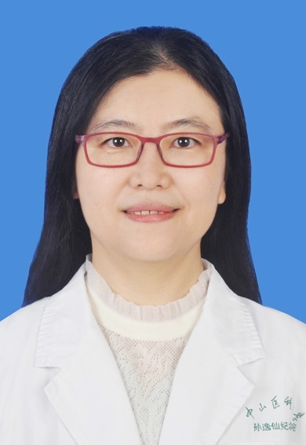

<!-- AUTO-GENERATED-BY: work/generate_obsidian_profiles.py -->

<!-- TEMPLATE: D:\workspace\信息收集整理\医生画像仓库\模板\医生画像模板.md -->

# 智慧

## 基础信息

| 字段 | 内容 |
|---|---|
| 姓名 | 智慧 |
| 医院 | 中山大学孙逸仙纪念医院 |
| 科室 | 超声科 |
| 职称/身份 | 主任医师 |
| 来源链接 | [官网原文](https://www.gzsys.org.cn/doctor/14692) |
| 采集日期 | 2026-08-13 |

## 简介/擅长

## 教育与进修经历

- 主要教育经历：1994年本科毕业于山东医科大学临床医学专业，2001年硕士研究生毕业于中山医科大学消化内科专业，2005年毕业于中山大学影像医学与核医学专业。

## 科研项目与成果

- 主持国家自然科学基金项目一项。

## 论文与学术产出

- 以第一作者或通讯作者发表医学论证50余篇，其中SCI期刊20篇。

## 可包装亮点

- 医学博士，主任医师，硕士研究生导师。
- 主持国家自然科学基金项目一项。
- 以第一作者或通讯作者发表医学论证50余篇，其中SCI期刊20篇。
- 学术任职：中国医师协会浅表器官专业委员会委员，中华超声医学杂志（电子版）评审专家，实用医学杂志评审专家，European Radiology杂志评审专家。

## 重点疾病/人群标签

- 慢性病：
- 肿瘤：
- 生殖疾病：
- 免疫/风湿：
- 术后恢复/康复：
- 疑难重症：

## 证据摘录

> 只摘录官网公开信息中的短句或关键字段，不复制大段原文。

- 官网身份字段：主任医师
- 官网亮眼经历线索：医学博士，主任医师，硕士研究生导师。 主持国家自然科学基金项目一项。 以第一作者或通讯作者发表医学论证50余篇，其中SCI期刊20篇。 学术任职：中国医师协会浅表器官专业委员会委员，中华超声医学杂志（电子版）评审专家，实用医学杂志评审专家，European Radiology杂志评审专家。
- 来源链接：https://www.gzsys.org.cn/doctor/14692

## BD 画像摘要

智慧医生可作为中山大学孙逸仙纪念医院超声科的基础医生资料入库。当前重点方向以总底表标签为准，官网未展示的信息保持空白。

## 合规边界

- 仅使用医院官网、官方公众号、官方小程序等公开渠道。
- 不采集私人电话、私人微信、家庭住址、患者隐私或非公开排班信息。
- 不写“保证治愈”“疗效第一”“包治疑难杂症”等无法由官网证明的表述。
