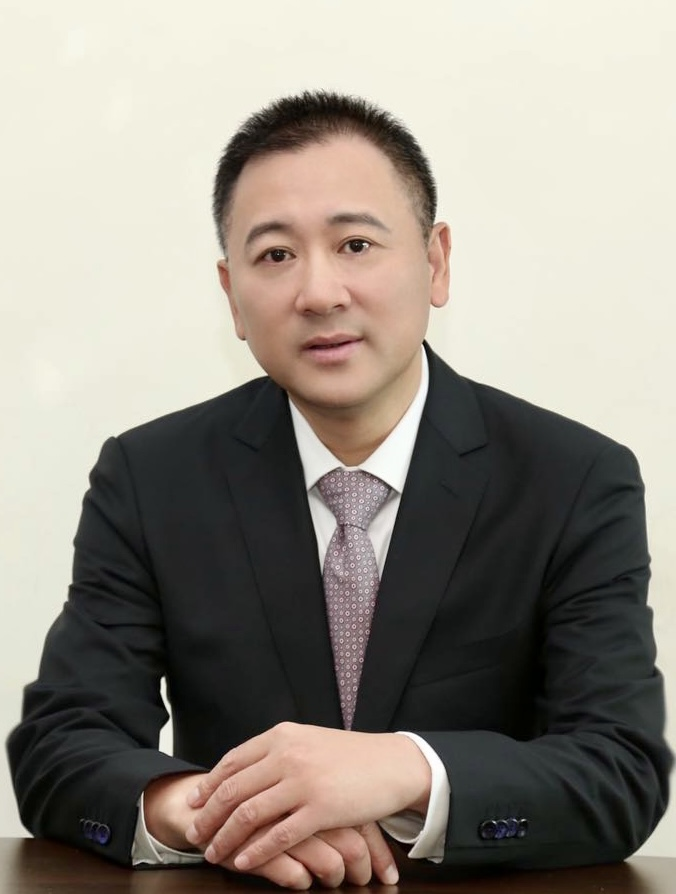

<!-- AUTO-GENERATED-BY: work/generate_obsidian_profiles.py -->

<!-- TEMPLATE: D:\workspace\信息收集整理\医生画像仓库\模板\医生画像模板.md -->

# 曹铭辉

## 基础信息

| 字段 | 内容 |
|---|---|
| 姓名 | 曹铭辉 |
| 医院 | 中山大学孙逸仙纪念医院 |
| 科室 | 麻醉科 |
| 职称/身份 | 教授, 主任医师 |
| 来源链接 | [官网原文](https://www.gzsys.org.cn/node/14637) |
| 采集日期 | 2026-08-13 |

## 简介/擅长

## 科研项目与成果

- 在临床及基础研究方面均取得了一系列的成果，近年主持国家自然科学基金面上项目2项，省部级科研项目多项，相关研究成果已发表SCI论文三十多篇。

## 论文与学术产出

- 在临床及基础研究方面均取得了一系列的成果，近年主持国家自然科学基金面上项目2项，省部级科研项目多项，相关研究成果已发表SCI论文三十多篇。

## 可包装亮点

- 曹铭辉，医学博士，主任医师，教授，博士生导师，中山大学孙逸仙纪念医院麻醉科主任，麻醉专业住培基地主任。
- 担任广东省医师协会麻醉科医师分会主任委员，广东省医学会麻醉分会副主任委员，广东省抗癌协会肿瘤麻醉与镇痛治疗专业委会名誉主任委员，中国医师协会麻醉科医师分会常委，中国抗癌协会肿瘤麻醉与镇痛治疗专业委会常委。
- 长期从事临床麻醉与疼痛诊疗工作，擅长各种疑难危重病例的麻醉及围术期管理，尤其在复杂肝胆手术、口腔颌面恶性肿瘤扩大切除并皮瓣转移修复手术的精细管理及困难气道的紧急应对方面积累了丰富的临床经验。
- 近年来致力于促进多学科综合诊疗模式下ERAS理念的临床应用实践，参与2017版《腹腔镜肝脏切除加速康复外科中国专家共识》及2018版《中国加速康复外科中国专家共识及路径管理指南》的编写。

## 重点疾病/人群标签

- 慢性病：
- 肿瘤：肿瘤、癌、康复、疼痛、疑难、危重、复杂、多学科
- 生殖疾病：
- 免疫/风湿：
- 术后恢复/康复：肿瘤、癌、康复、疼痛、疑难、危重、复杂、多学科
- 疑难重症：肿瘤、癌、康复、疼痛、疑难、危重、复杂、多学科

## 证据摘录

> 只摘录官网公开信息中的短句或关键字段，不复制大段原文。

- 官网身份字段：教授, 主任医师
- 官网亮眼经历线索：曹铭辉，医学博士，主任医师，教授，博士生导师，中山大学孙逸仙纪念医院麻醉科主任，麻醉专业住培基地主任。 担任广东省医师协会麻醉科医师分会主任委员，广东省医学会麻醉分会副主任委员，广东省抗癌协会肿瘤麻醉与镇痛治疗专业委会名誉主任委员，中国医师协会麻醉科医师分会常委，中国抗癌协会肿瘤麻醉与镇痛治疗专业委会常委。 长期从事临床麻醉与疼痛诊疗工作，擅长各种疑难危重病例的麻醉及围术期管理，尤其在复杂肝胆手术、口腔颌面恶性肿瘤扩大切除并皮瓣转移修…
- 来源链接：https://www.gzsys.org.cn/node/14637

## BD 画像摘要

曹铭辉医生可作为肿瘤、术后恢复/康复、疑难重症方向的基础画像候选。后续 BD 使用应继续以官网来源和人工复核为准，不添加疗效承诺或无来源包装。

## 合规边界

- 仅使用医院官网、官方公众号、官方小程序等公开渠道。
- 不采集私人电话、私人微信、家庭住址、患者隐私或非公开排班信息。
- 不写“保证治愈”“疗效第一”“包治疑难杂症”等无法由官网证明的表述。
