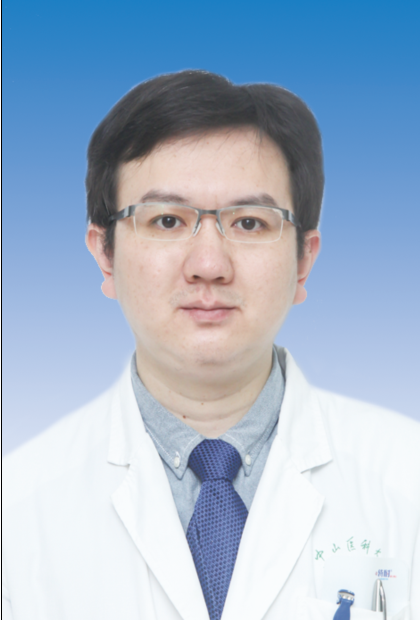

<!-- AUTO-GENERATED-BY: work/generate_obsidian_profiles.py -->

<!-- TEMPLATE: D:\workspace\信息收集整理\医生画像仓库\模板\医生画像模板.md -->

# 曾育杰

## 基础信息

| 字段 | 内容 |
|---|---|
| 姓名 | 曾育杰 |
| 医院 | 中山大学孙逸仙纪念医院 |
| 科室 | 胃肠外科 |
| 职称/身份 | 副主任医师 |
| 来源链接 | [官网原文](https://www.gzsys.org.cn/doctor/14794) |
| 采集日期 | 2026-08-13 |

## 简介/擅长

## 科研项目与成果

- 目前承担国家自然科学基金及广东省医学基金各1项。

## 论文与学术产出

- 对胃肠道恶性肿瘤并肝转移，特别是胃肠道神经内分泌肿瘤及胃肠道间质瘤的诊断治疗方面，进行了深入的研究，积累了丰富的经验，发表相关SCI 文章10余篇。

## 可包装亮点

- 博士，硕士生导师。
- 广东省医学教育协会普通外科分会委员，广东省医师协会胃肠外科医师分会青年专业组委员。
- 对胃肠道恶性肿瘤并肝转移，特别是胃肠道神经内分泌肿瘤及胃肠道间质瘤的诊断治疗方面，进行了深入的研究，积累了丰富的经验，发表相关SCI 文章10余篇。
- 目前承担国家自然科学基金及广东省医学基金各1项。

## 重点疾病/人群标签

- 慢性病：
- 肿瘤：肿瘤、瘤
- 生殖疾病：
- 免疫/风湿：
- 术后恢复/康复：
- 疑难重症：

## 证据摘录

> 只摘录官网公开信息中的短句或关键字段，不复制大段原文。

- 官网身份字段：副主任医师
- 官网亮眼经历线索：博士，硕士生导师。 广东省医学教育协会普通外科分会委员，广东省医师协会胃肠外科医师分会青年专业组委员。 对胃肠道恶性肿瘤并肝转移，特别是胃肠道神经内分泌肿瘤及胃肠道间质瘤的诊断治疗方面，进行了深入的研究，积累了丰富的经验，发表相关SCI 文章10余篇。 目前承担国家自然科学基金及广东省医学基金各1项。
- 来源链接：https://www.gzsys.org.cn/doctor/14794

## BD 画像摘要

曾育杰医生可作为肿瘤方向的基础画像候选。后续 BD 使用应继续以官网来源和人工复核为准，不添加疗效承诺或无来源包装。

## 合规边界

- 仅使用医院官网、官方公众号、官方小程序等公开渠道。
- 不采集私人电话、私人微信、家庭住址、患者隐私或非公开排班信息。
- 不写“保证治愈”“疗效第一”“包治疑难杂症”等无法由官网证明的表述。
