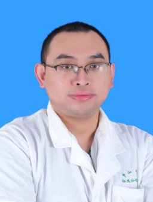

<!-- AUTO-GENERATED-BY: work/generate_obsidian_profiles.py -->

<!-- TEMPLATE: D:\workspace\信息收集整理\医生画像仓库\模板\医生画像模板.md -->

# 朱玥

## 基础信息

| 字段 | 内容 |
|---|---|
| 姓名 | 朱玥 |
| 医院 | 中山大学孙逸仙纪念医院 |
| 科室 | 甲状腺外科 |
| 职称/身份 | 副主任医师 |
| 来源链接 | [官网原文](https://www.gzsys.org.cn/node/15441) |
| 采集日期 | 2026-08-13 |

## 简介/擅长

## 科研项目与成果

- 第一作者在Experimental & Molecular Medicine、Cancer medicine、WJSO、JCEM等SCI杂志发表论文多篇，主持广州市科技项目一项，参与多项国家及省级基金。

## 论文与学术产出

- 第一作者在Experimental & Molecular Medicine、Cancer medicine、WJSO、JCEM等SCI杂志发表论文多篇，主持广州市科技项目一项，参与多项国家及省级基金。

## 可包装亮点

- 中山大学八年制临床医学博士，师从我国著名普外科专家王捷教授 中山大学孙逸仙纪念医院甲状腺外科主治医师 硕士生导师 广东省临床医学学会甲状腺专委会青年委员 广东省抗癌协会甲状腺专委会青年委员 主要从事于甲状腺疾病的规范化诊疗工作，对甲状腺癌外科手术治疗、甲状腺及颈部淋巴结细针穿刺、甲状腺结节热消融治疗具有丰富的临床经验。
- 第一作者在Experimental & Molecular Medicine、Cancer medicine、WJSO、JCEM等SCI杂志发表论文多篇，主持广州市科技项目一项，参与多项国家及省级基金。

## 重点疾病/人群标签

- 慢性病：
- 肿瘤：癌
- 生殖疾病：
- 免疫/风湿：
- 术后恢复/康复：
- 疑难重症：

## 证据摘录

> 只摘录官网公开信息中的短句或关键字段，不复制大段原文。

- 官网身份字段：副主任医师
- 官网亮眼经历线索：中山大学八年制临床医学博士，师从我国著名普外科专家王捷教授 中山大学孙逸仙纪念医院甲状腺外科主治医师 硕士生导师 广东省临床医学学会甲状腺专委会青年委员 广东省抗癌协会甲状腺专委会青年委员 主要从事于甲状腺疾病的规范化诊疗工作，对甲状腺癌外科手术治疗、甲状腺及颈部淋巴结细针穿刺、甲状腺结节热消融治疗具有丰富的临床经验。 第一作者在Experimental & Molecular Medicine、Cancer medicine、WJS…
- 来源链接：https://www.gzsys.org.cn/node/15441

## BD 画像摘要

朱玥医生可作为肿瘤方向的基础画像候选。后续 BD 使用应继续以官网来源和人工复核为准，不添加疗效承诺或无来源包装。

## 合规边界

- 仅使用医院官网、官方公众号、官方小程序等公开渠道。
- 不采集私人电话、私人微信、家庭住址、患者隐私或非公开排班信息。
- 不写“保证治愈”“疗效第一”“包治疑难杂症”等无法由官网证明的表述。
