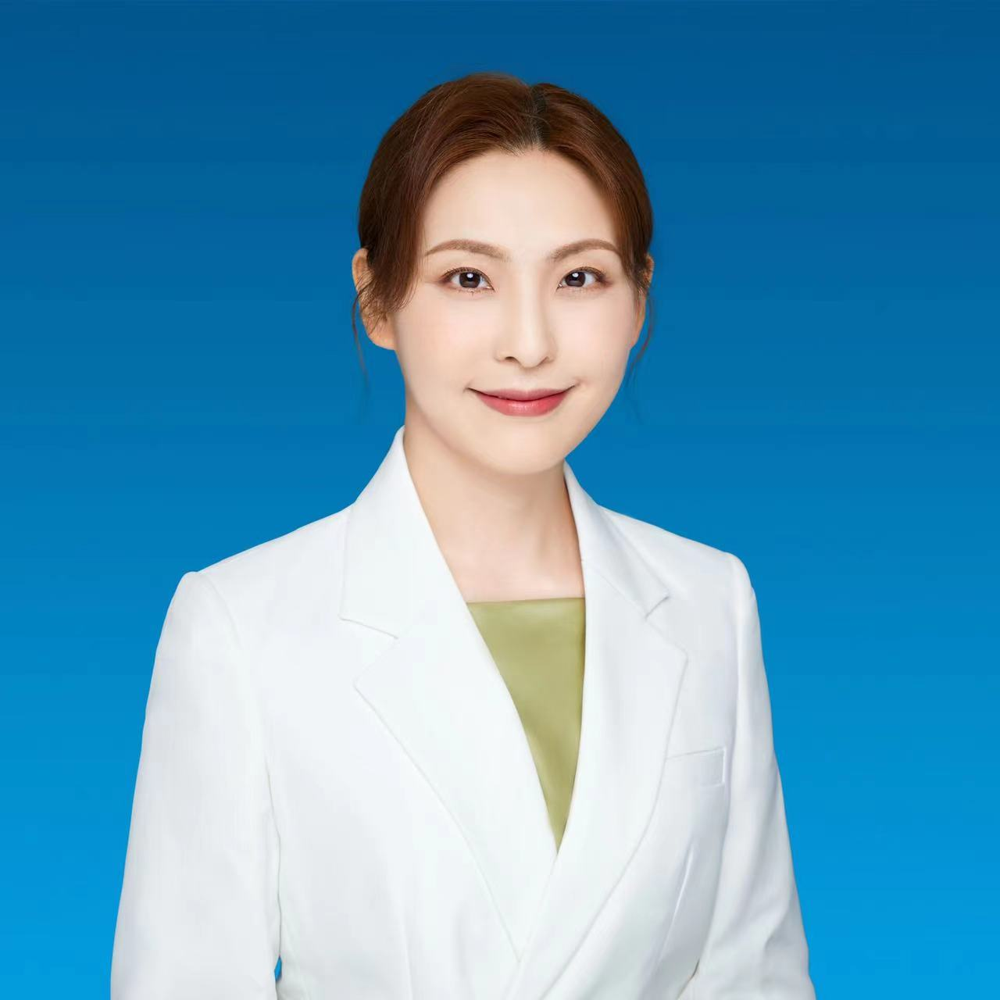

<!-- AUTO-GENERATED-BY: work/generate_obsidian_profiles.py -->

<!-- TEMPLATE: D:\workspace\信息收集整理\医生画像仓库\模板\医生画像模板.md -->

# 李丹

## 基础信息

| 字段 | 内容 |
|---|---|
| 姓名 | 李丹 |
| 医院 | 中山大学孙逸仙纪念医院 |
| 科室 | 核医学科 |
| 职称/身份 | 主任医师, 副教授 |
| 来源链接 | [官网原文](https://www.gzsys.org.cn/node/20599) |
| 采集日期 | 2026-08-13 |

## 简介/擅长

## 科研项目与成果

- 拥有实用新型专利3项，申请发明专利3项。

## 论文与学术产出

- 在国内外学术期刊发表医学论文92篇，发表SCI文章共61篇，其中作为第一作者发表SCI论文18篇，通讯作者发表SCI论文16篇。

## 可包装亮点

- 中山大学孙逸仙纪念医院核医学科副主任（主持工作），同济大学与美国哈佛大学联合培养博士，主任医师，副教授，硕士/博士生导师。
- 上海医学会核医学分会青年副主委，中国医学影像技术研究会核医学分会青年委员，中华医学会核医学分会，神经学组+对外交流学组组员，上海市中西医结合学会核医学专业委员会委员。
- 全国核医学“优秀青年才俊”，上海市“医苑新星”，上海市医学会核医学分会“先进个人”，上海市“静安区青年岗位能手”等。
- 在国内外学术期刊发表医学论文92篇，发表SCI文章共61篇，其中作为第一作者发表SCI论文18篇，通讯作者发表SCI论文16篇。

## 重点疾病/人群标签

- 慢性病：
- 肿瘤：癌、瘤
- 生殖疾病：
- 免疫/风湿：
- 术后恢复/康复：
- 疑难重症：

## 证据摘录

> 只摘录官网公开信息中的短句或关键字段，不复制大段原文。

- 官网身份字段：主任医师, 副教授
- 官网亮眼经历线索：中山大学孙逸仙纪念医院核医学科副主任（主持工作），同济大学与美国哈佛大学联合培养博士，主任医师，副教授，硕士/博士生导师。 上海医学会核医学分会青年副主委，中国医学影像技术研究会核医学分会青年委员，中华医学会核医学分会，神经学组+对外交流学组组员，上海市中西医结合学会核医学专业委员会委员。 全国核医学“优秀青年才俊”，上海市“医苑新星”，上海市医学会核医学分会“先进个人”，上海市“静安区青年岗位能手”等。 在国内外学术期刊发表医学论文…
- 来源链接：https://www.gzsys.org.cn/node/20599

## BD 画像摘要

李丹医生可作为肿瘤方向的基础画像候选。后续 BD 使用应继续以官网来源和人工复核为准，不添加疗效承诺或无来源包装。

## 合规边界

- 仅使用医院官网、官方公众号、官方小程序等公开渠道。
- 不采集私人电话、私人微信、家庭住址、患者隐私或非公开排班信息。
- 不写“保证治愈”“疗效第一”“包治疑难杂症”等无法由官网证明的表述。
