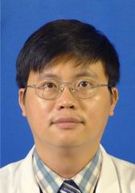

<!-- AUTO-GENERATED-BY: work/generate_obsidian_profiles.py -->

<!-- TEMPLATE: D:\workspace\信息收集整理\医生画像仓库\模板\医生画像模板.md -->

# 李劲高

## 基础信息

| 字段 | 内容 |
|---|---|
| 姓名 | 李劲高 |
| 医院 | 中山大学孙逸仙纪念医院 |
| 科室 | 肾内科 |
| 职称/身份 | 副主任医师 |
| 来源链接 | [官网原文](https://www.gzsys.org.cn/doctor/14556) |
| 采集日期 | 2026-08-13 |

## 简介/擅长

## 科研项目与成果

- 以第1负责人参与获得2013年广东省科技计划基金项目 1 项，以第3负责人参与获得国家自然基金项目1项，以第2负责人参与获得广东省科技计划基金项目 2 项及广东省中医药局基金2项。
- 以第2负责人获得了“广东省科技进步三等奖”成果。

## 论文与学术产出

- 发表SCI文章 2 篇，国内文章 6 篇。

## 可包装亮点

- 医德医风好，医疗技术水平优秀，能处理肾内科专业疑难病例，临床能力突出，曾担任病区区长，血液净化室区长，教学区长，医保专管员等职务，独立开展腹透置管手术 近200台，深静脉插管手术 200余台，肾穿200余例，是科室开展临床工作业务骨干，现任广东省医院协会血液净化中心管理专业委员会常务委员 ，定期到增城人民医院查房，指导临床工作。
- 以第2负责人获得了“广东省科技进步三等奖”成果。
- 发表SCI文章 2 篇，国内文章 6 篇。

## 重点疾病/人群标签

- 慢性病：
- 肿瘤：
- 生殖疾病：
- 免疫/风湿：
- 术后恢复/康复：
- 疑难重症：疑难

## 证据摘录

> 只摘录官网公开信息中的短句或关键字段，不复制大段原文。

- 官网身份字段：副主任医师
- 官网亮眼经历线索：医德医风好，医疗技术水平优秀，能处理肾内科专业疑难病例，临床能力突出，曾担任病区区长，血液净化室区长，教学区长，医保专管员等职务，独立开展腹透置管手术 近200台，深静脉插管手术 200余台，肾穿200余例，是科室开展临床工作业务骨干，现任广东省医院协会血液净化中心管理专业委员会常务委员 ，定期到增城人民医院查房，指导临床工作。 以第2负责人获得了“广东省科技进步三等奖”成果。 发表SCI文章 2 篇，国内文章 6 篇。
- 来源链接：https://www.gzsys.org.cn/doctor/14556

## BD 画像摘要

李劲高医生可作为疑难重症方向的基础画像候选。后续 BD 使用应继续以官网来源和人工复核为准，不添加疗效承诺或无来源包装。

## 合规边界

- 仅使用医院官网、官方公众号、官方小程序等公开渠道。
- 不采集私人电话、私人微信、家庭住址、患者隐私或非公开排班信息。
- 不写“保证治愈”“疗效第一”“包治疑难杂症”等无法由官网证明的表述。
