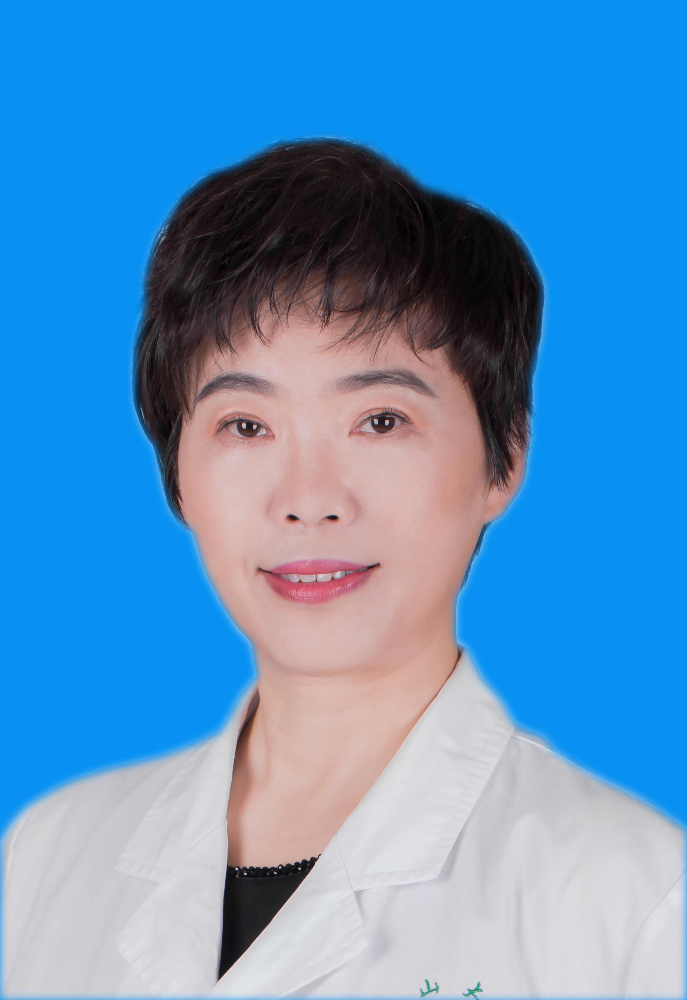

<!-- AUTO-GENERATED-BY: work/generate_obsidian_profiles.py -->

<!-- TEMPLATE: D:\workspace\信息收集整理\医生画像仓库\模板\医生画像模板.md -->

# 李勇

## 基础信息

| 字段 | 内容 |
|---|---|
| 姓名 | 李勇 |
| 医院 | 中山大学孙逸仙纪念医院 |
| 科室 | 放射科影像专科 |
| 职称/身份 | 主任医师 |
| 来源链接 | [官网原文](https://www.gzsys.org.cn/node/14617) |
| 采集日期 | 2026-08-13 |

## 简介/擅长

## 教育与进修经历

- 参与本科、研究生及进修生教学工作近三十年，做为硕导，已毕业学生7人。

## 科研项目与成果

- 以发表论文四十余篇，并完成数项省级科学基金。

## 论文与学术产出

- 以发表论文四十余篇，并完成数项省级科学基金。

## 可包装亮点

- 放射科副主任，主任医师，1991年开始从事影像诊断，长期在一线工作，临床经验丰富。
- 参与本科、研究生及进修生教学工作近三十年，做为硕导，已毕业学生7人。
- 以发表论文四十余篇，并完成数项省级科学基金。
- 目前社会兼职有：女医师协会广东省放射学分会副组委，中国医师协会放射学分会泌尿生殖学组委员，广东省医学会放射学分会对比剂学组副组长，广东省医师协会放射学分会消化学组委员，广东省癌症学会放射学分会常委，广东省肝病学会放射学分会常委等职。

## 重点疾病/人群标签

- 慢性病：
- 肿瘤：癌、生殖
- 生殖疾病：癌、生殖
- 免疫/风湿：
- 术后恢复/康复：
- 疑难重症：

## 证据摘录

> 只摘录官网公开信息中的短句或关键字段，不复制大段原文。

- 官网身份字段：主任医师
- 官网亮眼经历线索：放射科副主任，主任医师，1991年开始从事影像诊断，长期在一线工作，临床经验丰富。 参与本科、研究生及进修生教学工作近三十年，做为硕导，已毕业学生7人。 以发表论文四十余篇，并完成数项省级科学基金。 目前社会兼职有：女医师协会广东省放射学分会副组委，中国医师协会放射学分会泌尿生殖学组委员，广东省医学会放射学分会对比剂学组副组长，广东省医师协会放射学分会消化学组委员，广东省癌症学会放射学分会常委，广东省肝病学会放射学分会常委等职。
- 来源链接：https://www.gzsys.org.cn/node/14617

## BD 画像摘要

李勇医生可作为肿瘤、生殖疾病方向的基础画像候选。后续 BD 使用应继续以官网来源和人工复核为准，不添加疗效承诺或无来源包装。

## 合规边界

- 仅使用医院官网、官方公众号、官方小程序等公开渠道。
- 不采集私人电话、私人微信、家庭住址、患者隐私或非公开排班信息。
- 不写“保证治愈”“疗效第一”“包治疑难杂症”等无法由官网证明的表述。
