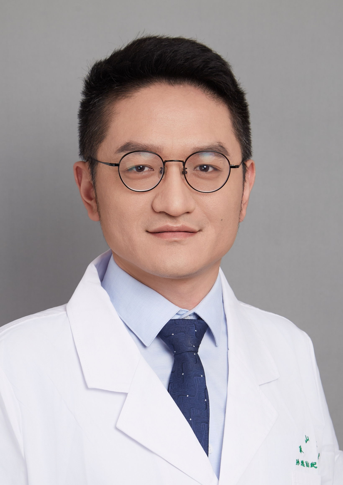

<!-- AUTO-GENERATED-BY: work/generate_obsidian_profiles.py -->

<!-- TEMPLATE: D:\workspace\信息收集整理\医生画像仓库\模板\医生画像模板.md -->

# 李卓

## 基础信息

| 字段 | 内容 |
|---|---|
| 姓名 | 李卓 |
| 医院 | 中山大学孙逸仙纪念医院 |
| 科室 | 肿瘤内科 |
| 职称/身份 | 主治医师 |
| 来源链接 | [官网原文](https://www.gzsys.org.cn/doctor/29823) |
| 采集日期 | 2026-08-13 |

## 简介/擅长

## 教育与进修经历

- 中山大学肿瘤学博士、博士后，擅长肺癌、肝癌、胆管癌、胰腺癌、胃肠恶性肿瘤、鼻咽癌、淋巴瘤等多种肿瘤的免疫、靶向、化疗等综合治疗，主持省部级基金一项，参与国家自然科学基金面上项目多项，发表多篇SCI论文

## 科研项目与成果

- 中山大学肿瘤学博士、博士后，擅长肺癌、肝癌、胆管癌、胰腺癌、胃肠恶性肿瘤、鼻咽癌、淋巴瘤等多种肿瘤的免疫、靶向、化疗等综合治疗，主持省部级基金一项，参与国家自然科学基金面上项目多项，发表多篇SCI论文

## 论文与学术产出

- 中山大学肿瘤学博士、博士后，擅长肺癌、肝癌、胆管癌、胰腺癌、胃肠恶性肿瘤、鼻咽癌、淋巴瘤等多种肿瘤的免疫、靶向、化疗等综合治疗，主持省部级基金一项，参与国家自然科学基金面上项目多项，发表多篇SCI论文

## 可包装亮点

- 中山大学肿瘤学博士、博士后，擅长肺癌、肝癌、胆管癌、胰腺癌、胃肠恶性肿瘤、鼻咽癌、淋巴瘤等多种肿瘤的免疫、靶向、化疗等综合治疗，主持省部级基金一项，参与国家自然科学基金面上项目多项，发表多篇SCI论文

## 重点疾病/人群标签

- 慢性病：
- 肿瘤：肿瘤、癌、淋巴瘤、化疗、靶向、鼻咽癌、肺癌、肝癌、免疫
- 生殖疾病：
- 免疫/风湿：肿瘤、癌、淋巴瘤、化疗、靶向、鼻咽癌、肺癌、肝癌、免疫
- 术后恢复/康复：
- 疑难重症：

## 证据摘录

> 只摘录官网公开信息中的短句或关键字段，不复制大段原文。

- 官网身份字段：主治医师
- 官网亮眼经历线索：中山大学肿瘤学博士、博士后，擅长肺癌、肝癌、胆管癌、胰腺癌、胃肠恶性肿瘤、鼻咽癌、淋巴瘤等多种肿瘤的免疫、靶向、化疗等综合治疗，主持省部级基金一项，参与国家自然科学基金面上项目多项，发表多篇SCI论文
- 来源链接：https://www.gzsys.org.cn/doctor/29823

## BD 画像摘要

李卓医生可作为肿瘤、免疫/风湿/感染方向的基础画像候选。后续 BD 使用应继续以官网来源和人工复核为准，不添加疗效承诺或无来源包装。

## 合规边界

- 仅使用医院官网、官方公众号、官方小程序等公开渠道。
- 不采集私人电话、私人微信、家庭住址、患者隐私或非公开排班信息。
- 不写“保证治愈”“疗效第一”“包治疑难杂症”等无法由官网证明的表述。
