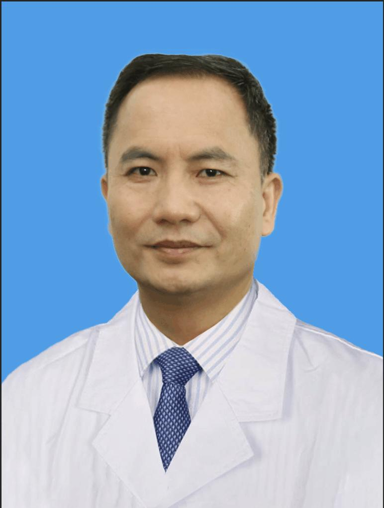

<!-- AUTO-GENERATED-BY: work/generate_obsidian_profiles.py -->

<!-- TEMPLATE: D:\workspace\信息收集整理\医生画像仓库\模板\医生画像模板.md -->

# 李国成

## 基础信息

| 字段 | 内容 |
|---|---|
| 姓名 | 李国成 |
| 医院 | 中山大学孙逸仙纪念医院 |
| 科室 | 药学部 |
| 职称/身份 | 主任药师 |
| 来源链接 | [官网原文](https://www.gzsys.org.cn/node/14623) |
| 采集日期 | 2026-08-13 |

## 简介/擅长

## 科研项目与成果

- 主持广东省科技计划资助项目3项，主持广东省建设中医强省科研项目2项，发表论文50多篇，其中SCI6篇，出版专著1部。

## 论文与学术产出

- 主持广东省科技计划资助项目3项，主持广东省建设中医强省科研项目2项，发表论文50多篇，其中SCI6篇，出版专著1部。

## 可包装亮点

- 主持广东省科技计划资助项目3项，主持广东省建设中医强省科研项目2项，发表论文50多篇，其中SCI6篇，出版专著1部。
- 社会兼职：广东省药学会第十七届理事，广东省药学会医院制剂专家委员会副主任委员，广东省药学会老年专业委员会副主任委员，广东省中医药学会医院药学专业委员会副主任委员，《中国医院药学》杂志、《中药材》杂志、《今日药学》杂志编委。

## 重点疾病/人群标签

- 慢性病：
- 肿瘤：
- 生殖疾病：
- 免疫/风湿：
- 术后恢复/康复：
- 疑难重症：

## 证据摘录

> 只摘录官网公开信息中的短句或关键字段，不复制大段原文。

- 官网身份字段：主任药师
- 官网亮眼经历线索：主持广东省科技计划资助项目3项，主持广东省建设中医强省科研项目2项，发表论文50多篇，其中SCI6篇，出版专著1部。 社会兼职：广东省药学会第十七届理事，广东省药学会医院制剂专家委员会副主任委员，广东省药学会老年专业委员会副主任委员，广东省中医药学会医院药学专业委员会副主任委员，《中国医院药学》杂志、《中药材》杂志、《今日药学》杂志编委。
- 异常提示：职称/身份需人工复核
- 来源链接：https://www.gzsys.org.cn/node/14623

## BD 画像摘要

李国成医生可作为中山大学孙逸仙纪念医院药学部的基础医生资料入库。当前重点方向以总底表标签为准，官网未展示的信息保持空白。

## 合规边界

- 仅使用医院官网、官方公众号、官方小程序等公开渠道。
- 不采集私人电话、私人微信、家庭住址、患者隐私或非公开排班信息。
- 不写“保证治愈”“疗效第一”“包治疑难杂症”等无法由官网证明的表述。
