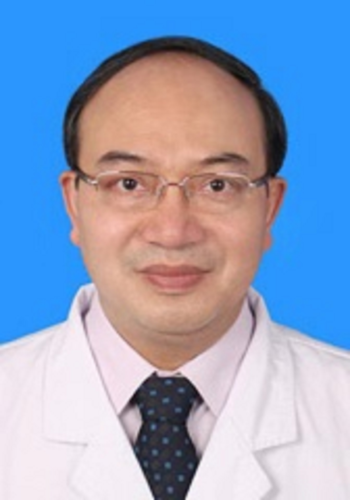

<!-- AUTO-GENERATED-BY: work/generate_obsidian_profiles.py -->

<!-- TEMPLATE: D:\workspace\信息收集整理\医生画像仓库\模板\医生画像模板.md -->

# 李春海

## 基础信息

| 字段 | 内容 |
|---|---|
| 姓名 | 李春海 |
| 医院 | 中山大学孙逸仙纪念医院 |
| 科室 | 骨外科 |
| 职称/身份 | 教授, 主任医师 |
| 来源链接 | [官网原文](https://www.gzsys.org.cn/node/14561) |
| 采集日期 | 2026-08-13 |

## 简介/擅长

## 教育与进修经历

- 学习经历：1991年毕业于中山医科大学临床医学院，2000年获博士学位。

## 科研项目与成果

- 项目及奖项：（1）《脊柱侧弯预防与治疗的系列研究》获市科技进步二等奖；
- （3）《基于虚拟现实技术（VR）医学教学体系的构建》获广东省教育成果一等奖；
- （4）主持或参与国家及、省部级和市级科研项目多项；

## 论文与学术产出

- 在SCI杂志及国内核心期刊发表学术论文近50篇。

## 可包装亮点

- 职称：骨外科主任医师、教授、临床医学博士、研究生导师 任职：现任外科教研室主任、骨外科副主任。
- 学术任职：国际矫形与创伤外科学会（SICOT）中国部脊柱外科学会委员、微创外科学会第一届委员会委员、中国医师协会脊柱内镜学组委员、广东省康复医学会骨质疏松与相关疾病分会会长、广东省医学会脊柱外科分会副主委、微创学组副组长、互联网智能脊柱学组组长、广东省中西医结合学会骨伤专业委员会副组委、广东省医学会骨科分会微创学组副组长。
- 曾到香港、瑞士、美国、英国等地的著名医疗机构交流、深造。
- 项目及奖项：（1）《脊柱侧弯预防与治疗的系列研究》获市科技进步二等奖；

## 重点疾病/人群标签

- 慢性病：
- 肿瘤：肿瘤、感染、康复
- 生殖疾病：
- 免疫/风湿：肿瘤、感染、康复
- 术后恢复/康复：肿瘤、感染、康复
- 疑难重症：

## 证据摘录

> 只摘录官网公开信息中的短句或关键字段，不复制大段原文。

- 官网身份字段：教授, 主任医师
- 官网亮眼经历线索：职称：骨外科主任医师、教授、临床医学博士、研究生导师 任职：现任外科教研室主任、骨外科副主任。 学术任职：国际矫形与创伤外科学会（SICOT）中国部脊柱外科学会委员、微创外科学会第一届委员会委员、中国医师协会脊柱内镜学组委员、广东省康复医学会骨质疏松与相关疾病分会会长、广东省医学会脊柱外科分会副主委、微创学组副组长、互联网智能脊柱学组组长、广东省中西医结合学会骨伤专业委员会副组委、广东省医学会骨科分会微创学组副组长。 曾到香港、瑞士…
- 来源链接：https://www.gzsys.org.cn/node/14561

## BD 画像摘要

李春海医生可作为肿瘤、免疫/风湿/感染、术后恢复/康复方向的基础画像候选。后续 BD 使用应继续以官网来源和人工复核为准，不添加疗效承诺或无来源包装。

## 合规边界

- 仅使用医院官网、官方公众号、官方小程序等公开渠道。
- 不采集私人电话、私人微信、家庭住址、患者隐私或非公开排班信息。
- 不写“保证治愈”“疗效第一”“包治疑难杂症”等无法由官网证明的表述。
