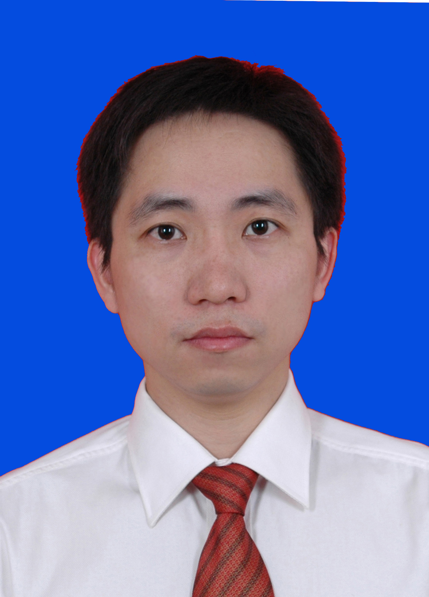

<!-- AUTO-GENERATED-BY: work/generate_obsidian_profiles.py -->

<!-- TEMPLATE: D:\workspace\信息收集整理\医生画像仓库\模板\医生画像模板.md -->

# 李栋方

## 基础信息

| 字段 | 内容 |
|---|---|
| 姓名 | 李栋方 |
| 医院 | 中山大学孙逸仙纪念医院 |
| 科室 | 儿科神经内分泌专科 |
| 职称/身份 | 主任医师 |
| 来源链接 | [官网原文](https://www.gzsys.org.cn/node/14682) |
| 采集日期 | 2026-08-13 |

## 简介/擅长

## 教育与进修经历

- 英国卡迪夫大学生物科学院访问学者，2001年本科毕业留校在中山大学孙逸仙纪念医院工作，从事儿科医教研工作十余年，对呼吸、消化系统等儿科常见疾病有较丰富的诊治经验，尤擅长于各种小儿神经疾病的诊治，如癫痫、脑性瘫痪、热性惊厥、脑炎、面瘫、精神运动发育迟缓、抽动症、多动症等。

## 科研项目与成果

- 在SCI及国内核心期刊发表多篇论著，主持省部级和厅局级基金各一项，参与国家、省部级基金多项。

## 论文与学术产出

- 在SCI及国内核心期刊发表多篇论著，主持省部级和厅局级基金各一项，参与国家、省部级基金多项。

## 可包装亮点

- 英国卡迪夫大学生物科学院访问学者，2001年本科毕业留校在中山大学孙逸仙纪念医院工作，从事儿科医教研工作十余年，对呼吸、消化系统等儿科常见疾病有较丰富的诊治经验，尤擅长于各种小儿神经疾病的诊治，如癫痫、脑性瘫痪、热性惊厥、脑炎、面瘫、精神运动发育迟缓、抽动症、多动症等。
- 在SCI及国内核心期刊发表多篇论著，主持省部级和厅局级基金各一项，参与国家、省部级基金多项。

## 重点疾病/人群标签

- 慢性病：
- 肿瘤：
- 生殖疾病：
- 免疫/风湿：
- 术后恢复/康复：
- 疑难重症：

## 证据摘录

> 只摘录官网公开信息中的短句或关键字段，不复制大段原文。

- 官网身份字段：主任医师
- 官网亮眼经历线索：英国卡迪夫大学生物科学院访问学者，2001年本科毕业留校在中山大学孙逸仙纪念医院工作，从事儿科医教研工作十余年，对呼吸、消化系统等儿科常见疾病有较丰富的诊治经验，尤擅长于各种小儿神经疾病的诊治，如癫痫、脑性瘫痪、热性惊厥、脑炎、面瘫、精神运动发育迟缓、抽动症、多动症等。 在SCI及国内核心期刊发表多篇论著，主持省部级和厅局级基金各一项，参与国家、省部级基金多项。
- 来源链接：https://www.gzsys.org.cn/node/14682

## BD 画像摘要

李栋方医生可作为中山大学孙逸仙纪念医院儿科神经内分泌专科的基础医生资料入库。当前重点方向以总底表标签为准，官网未展示的信息保持空白。

## 合规边界

- 仅使用医院官网、官方公众号、官方小程序等公开渠道。
- 不采集私人电话、私人微信、家庭住址、患者隐私或非公开排班信息。
- 不写“保证治愈”“疗效第一”“包治疑难杂症”等无法由官网证明的表述。
