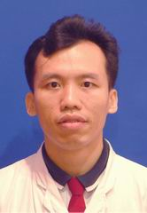

<!-- AUTO-GENERATED-BY: work/generate_obsidian_profiles.py -->

<!-- TEMPLATE: D:\workspace\信息收集整理\医生画像仓库\模板\医生画像模板.md -->

# 李海刚

## 基础信息

| 字段 | 内容 |
|---|---|
| 姓名 | 李海刚 |
| 医院 | 中山大学孙逸仙纪念医院 |
| 科室 | 病理科 |
| 职称/身份 | 主任医师 |
| 来源链接 | [官网原文](https://www.gzsys.org.cn/node/15222) |
| 采集日期 | 2026-08-13 |

## 简介/擅长

在手术中冰冻切片、乳腺疾病、骨与软组织肿瘤、头颈部肿瘤、造血系统肿瘤、甲状腺微小癌、儿童肿瘤穿刺活检等疑难病例病理诊断方面具有丰富经验。

## 教育与进修经历

- 1988年毕业于中山医科大学医疗系，毕业后留在附属第二医院(孙逸仙纪念医院)病理科工作至今。
- 1997年-2000年师从董书堃教授攻读硕士学位，研究方向为骨肿瘤。

## 科研项目与成果

- 已经发表超过100篇，其中SCI论文40多篇，其中第一作者或通讯作者的有13篇，作为第二申请人获得国家级、省级科研基金多项。

## 论文与学术产出

- 已经发表超过100篇，其中SCI论文40多篇，其中第一作者或通讯作者的有13篇，作为第二申请人获得国家级、省级科研基金多项。

## 可包装亮点

- 病理科主任医师、硕士生导师，现任病理科副主任。
- 每年亲自完成4000-6000例的病理诊断，其中的疑难病例约占三分之一，每年应邀到省内的三甲医院会诊超过50次，在手术中快速冰冻切片诊断、乳腺疾病、骨与软组织肿瘤、造血系统肿瘤、甲状腺微小癌、儿童肿瘤穿刺活检等方面具有丰富经验。
- 已经发表超过100篇，其中SCI论文40多篇，其中第一作者或通讯作者的有13篇，作为第二申请人获得国家级、省级科研基金多项。
- 担任广东省医师协会病理分会常务委员、中华医学会广东病理学分会委员、《岭南外科杂志》编委等。

## 重点疾病/人群标签

- 慢性病：
- 肿瘤：肿瘤、癌、疑难
- 生殖疾病：
- 免疫/风湿：
- 术后恢复/康复：
- 疑难重症：肿瘤、癌、疑难

## 证据摘录

> 只摘录官网公开信息中的短句或关键字段，不复制大段原文。

- 官网身份字段：主任医师
- 官网简介/擅长：在手术中冰冻切片、乳腺疾病、骨与软组织肿瘤、头颈部肿瘤、造血系统肿瘤、甲状腺微小癌、儿童肿瘤穿刺活检等疑难病例病理诊断方面具有丰富经验。
- 官网亮眼经历线索：病理科主任医师、硕士生导师，现任病理科副主任。 每年亲自完成4000-6000例的病理诊断，其中的疑难病例约占三分之一，每年应邀到省内的三甲医院会诊超过50次，在手术中快速冰冻切片诊断、乳腺疾病、骨与软组织肿瘤、造血系统肿瘤、甲状腺微小癌、儿童肿瘤穿刺活检等方面具有丰富经验。 已经发表超过100篇，其中SCI论文40多篇，其中第一作者或通讯作者的有13篇，作为第二申请人获得国家级、省级科研基金多项。 担任广东省医师协会病理分会常务委员…
- 来源链接：https://www.gzsys.org.cn/node/15222

## BD 画像摘要

李海刚医生可作为肿瘤、疑难重症方向的基础画像候选。后续 BD 使用应继续以官网来源和人工复核为准，不添加疗效承诺或无来源包装。

## 合规边界

- 仅使用医院官网、官方公众号、官方小程序等公开渠道。
- 不采集私人电话、私人微信、家庭住址、患者隐私或非公开排班信息。
- 不写“保证治愈”“疗效第一”“包治疑难杂症”等无法由官网证明的表述。
