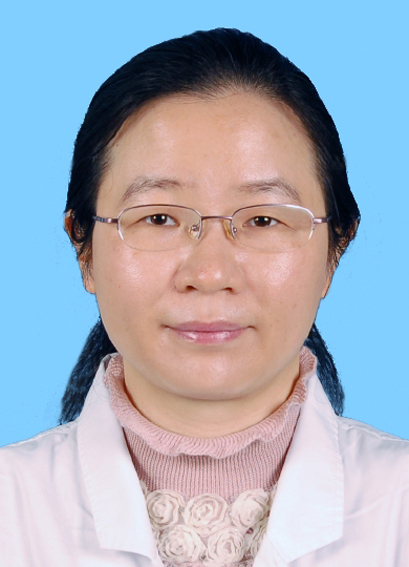

<!-- AUTO-GENERATED-BY: work/generate_obsidian_profiles.py -->

<!-- TEMPLATE: D:\workspace\信息收集整理\医生画像仓库\模板\医生画像模板.md -->

# 李益清

## 基础信息

| 字段 | 内容 |
|---|---|
| 姓名 | 李益清 |
| 医院 | 中山大学孙逸仙纪念医院 |
| 科室 | 血液内科 |
| 职称/身份 | 主任医师 |
| 来源链接 | [官网原文](https://www.gzsys.org.cn/node/14853) |
| 采集日期 | 2026-08-13 |

## 简介/擅长

## 教育与进修经历

- 2017年-2018年在国家留学基金委资助下赴美国MD安德森癌症中心研修，主要从事白血病耐药机制的研究。

## 科研项目与成果

- 2017年-2018年在国家留学基金委资助下赴美国MD安德森癌症中心研修，主要从事白血病耐药机制的研究。
- 主持国自然青年基金、教育部新教师基金项目、广东省自然科学基金、广东省科技计划等多项科研项目，发表学术论文多篇。

## 论文与学术产出

- 主持国自然青年基金、教育部新教师基金项目、广东省自然科学基金、广东省科技计划等多项科研项目，发表学术论文多篇。

## 可包装亮点

- 李益清，主任医师，现任广东省医师协会血液科医师分会委员，广东省抗癌协会血液肿瘤专业委员会青年委员，广东省医学会血液学分会青年委员，广东省精准医学应用学会精准血液病分会委员，广州抗癌协会病理学与分子病理诊断专业委员会常委。
- 2017年-2018年在国家留学基金委资助下赴美国MD安德森癌症中心研修，主要从事白血病耐药机制的研究。
- 主持国自然青年基金、教育部新教师基金项目、广东省自然科学基金、广东省科技计划等多项科研项目，发表学术论文多篇。

## 重点疾病/人群标签

- 慢性病：
- 肿瘤：肿瘤、癌、淋巴瘤、白血病
- 生殖疾病：
- 免疫/风湿：
- 术后恢复/康复：
- 疑难重症：

## 证据摘录

> 只摘录官网公开信息中的短句或关键字段，不复制大段原文。

- 官网身份字段：主任医师
- 官网亮眼经历线索：李益清，主任医师，现任广东省医师协会血液科医师分会委员，广东省抗癌协会血液肿瘤专业委员会青年委员，广东省医学会血液学分会青年委员，广东省精准医学应用学会精准血液病分会委员，广州抗癌协会病理学与分子病理诊断专业委员会常委。 2017年-2018年在国家留学基金委资助下赴美国MD安德森癌症中心研修，主要从事白血病耐药机制的研究。 主持国自然青年基金、教育部新教师基金项目、广东省自然科学基金、广东省科技计划等多项科研项目，发表学术论文多篇。
- 来源链接：https://www.gzsys.org.cn/node/14853

## BD 画像摘要

李益清医生可作为肿瘤方向的基础画像候选。后续 BD 使用应继续以官网来源和人工复核为准，不添加疗效承诺或无来源包装。

## 合规边界

- 仅使用医院官网、官方公众号、官方小程序等公开渠道。
- 不采集私人电话、私人微信、家庭住址、患者隐私或非公开排班信息。
- 不写“保证治愈”“疗效第一”“包治疑难杂症”等无法由官网证明的表述。
