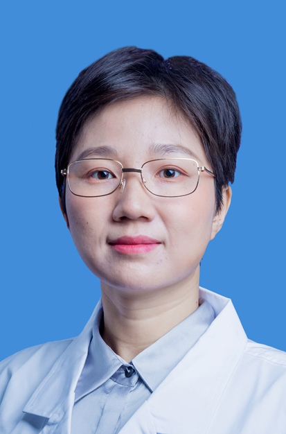

<!-- AUTO-GENERATED-BY: work/generate_obsidian_profiles.py -->

<!-- TEMPLATE: D:\workspace\信息收集整理\医生画像仓库\模板\医生画像模板.md -->

# 李艺

## 基础信息

| 字段 | 内容 |
|---|---|
| 姓名 | 李艺 |
| 医院 | 中山大学孙逸仙纪念医院 |
| 科室 | 神经科 |
| 职称/身份 | 主任医师 |
| 来源链接 | [官网原文](https://www.gzsys.org.cn/node/14739) |
| 采集日期 | 2026-08-13 |

## 简介/擅长

## 教育与进修经历

- 2009年中山大学神经病学专业博士研究生毕业，获博士学位。

## 科研项目与成果

- 主编论著一部，参编论著三部，在国内外杂志发表论文30余篇，主持国家级和省部级基金多项。

## 论文与学术产出

- 主编论著一部，参编论著三部，在国内外杂志发表论文30余篇，主持国家级和省部级基金多项。

## 可包装亮点

- 李艺，中山大学孙逸仙纪念医院神经内科主任医师，硕士生导师，广东省中西医结合学会神经科专委会秘书。
- 2008年赴美国学术交流一年，2015年赴澳大利亚学术交流一年。
- 主编论著一部，参编论著三部，在国内外杂志发表论文30余篇，主持国家级和省部级基金多项。

## 重点疾病/人群标签

- 慢性病：
- 肿瘤：肿瘤、化疗
- 生殖疾病：
- 免疫/风湿：
- 术后恢复/康复：
- 疑难重症：

## 证据摘录

> 只摘录官网公开信息中的短句或关键字段，不复制大段原文。

- 官网身份字段：主任医师
- 官网亮眼经历线索：李艺，中山大学孙逸仙纪念医院神经内科主任医师，硕士生导师，广东省中西医结合学会神经科专委会秘书。 2008年赴美国学术交流一年，2015年赴澳大利亚学术交流一年。 主编论著一部，参编论著三部，在国内外杂志发表论文30余篇，主持国家级和省部级基金多项。
- 来源链接：https://www.gzsys.org.cn/node/14739

## BD 画像摘要

李艺医生可作为肿瘤方向的基础画像候选。后续 BD 使用应继续以官网来源和人工复核为准，不添加疗效承诺或无来源包装。

## 合规边界

- 仅使用医院官网、官方公众号、官方小程序等公开渠道。
- 不采集私人电话、私人微信、家庭住址、患者隐私或非公开排班信息。
- 不写“保证治愈”“疗效第一”“包治疑难杂症”等无法由官网证明的表述。
