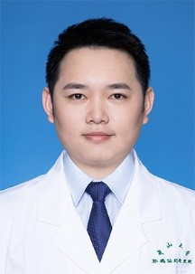

<!-- AUTO-GENERATED-BY: work/generate_obsidian_profiles.py -->

<!-- TEMPLATE: D:\workspace\信息收集整理\医生画像仓库\模板\医生画像模板.md -->

# 李金

## 基础信息

| 字段 | 内容 |
|---|---|
| 姓名 | 李金 |
| 医院 | 中山大学孙逸仙纪念医院 |
| 科室 | 妇科生殖内分泌专科 |
| 职称/身份 | 主治医师 |
| 来源链接 | [官网原文](https://www.gzsys.org.cn/doctor/15504) |
| 采集日期 | 2026-08-13 |

## 简介/擅长

## 教育与进修经历

- ★在郑州大学附属第三医院进行了系统性的显微男科培训。

## 科研项目与成果

- ★作为主要参与者参与了国家自然科学基金、广东省科技基金、广东省自然科学基金、广州市科技基金等科研项目。

## 论文与学术产出

- ★发表SCI文章2篇，中文核心期刊2篇。

## 可包装亮点

- ★作为主要参与者参与了国家自然科学基金、广东省科技基金、广东省自然科学基金、广州市科技基金等科研项目。
- ★发表SCI文章2篇，中文核心期刊2篇。
- ★广东省临床医学会生殖医学分会委员 专业擅长： ▲擅长中西医结合治疗男性少弱畸形精子症、无精症、人工授精、试管婴儿、包皮过长、勃起功能障碍、早泄、不射精症、血精、精囊炎、前列腺炎症、睾丸疼痛、精索静脉曲张等泌尿生殖男科疾病。

## 重点疾病/人群标签

- 慢性病：
- 肿瘤：癌、生殖、试管、疼痛、功能障碍
- 生殖疾病：癌、生殖、试管、疼痛、功能障碍
- 免疫/风湿：
- 术后恢复/康复：癌、生殖、试管、疼痛、功能障碍
- 疑难重症：

## 证据摘录

> 只摘录官网公开信息中的短句或关键字段，不复制大段原文。

- 官网身份字段：主治医师
- 官网亮眼经历线索：★作为主要参与者参与了国家自然科学基金、广东省科技基金、广东省自然科学基金、广州市科技基金等科研项目。 ★发表SCI文章2篇，中文核心期刊2篇。 ★广东省临床医学会生殖医学分会委员 专业擅长： ▲擅长中西医结合治疗男性少弱畸形精子症、无精症、人工授精、试管婴儿、包皮过长、勃起功能障碍、早泄、不射精症、血精、精囊炎、前列腺炎症、睾丸疼痛、精索静脉曲张等泌尿生殖男科疾病。
- 来源链接：https://www.gzsys.org.cn/doctor/15504

## BD 画像摘要

李金医生可作为肿瘤、生殖疾病、术后恢复/康复方向的基础画像候选。后续 BD 使用应继续以官网来源和人工复核为准，不添加疗效承诺或无来源包装。

## 合规边界

- 仅使用医院官网、官方公众号、官方小程序等公开渠道。
- 不采集私人电话、私人微信、家庭住址、患者隐私或非公开排班信息。
- 不写“保证治愈”“疗效第一”“包治疑难杂症”等无法由官网证明的表述。
