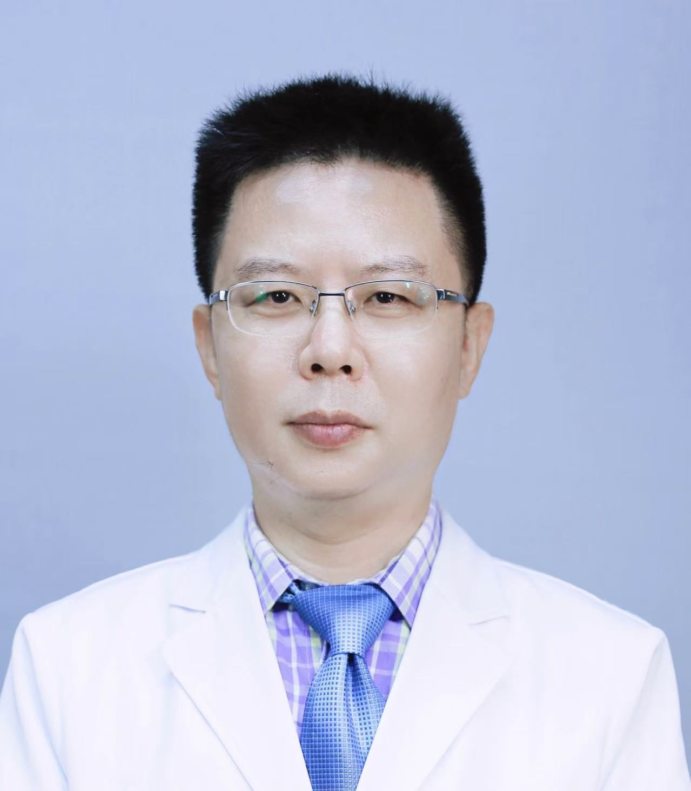

<!-- AUTO-GENERATED-BY: work/generate_obsidian_profiles.py -->

<!-- TEMPLATE: D:\workspace\信息收集整理\医生画像仓库\模板\医生画像模板.md -->

# 李鹤平

## 基础信息

| 字段 | 内容 |
|---|---|
| 姓名 | 李鹤平 |
| 医院 | 中山大学孙逸仙纪念医院 |
| 科室 | 肿瘤内科 |
| 职称/身份 | 教授, 主任医师 |
| 来源链接 | [官网原文](https://www.gzsys.org.cn/doctor/29131) |
| 采集日期 | 2026-08-13 |

## 简介/擅长

## 可包装亮点

- 教授、主任医师、博士生导师；
- 肿瘤内科主任；
- 担任中国医院协会精准医疗分会常务委员兼秘书长，中国医师协会肝癌内科专委会委员，中国抗癌协会肿瘤微环境专委会常务委员，中国抗癌协会肿瘤热疗专委会委员，广东省医师协会肿瘤重症专委会副主任委员，广东省抗癌协会多原发和不明原发肿瘤专委会副主任委员等。
- 获广东省医学科学技术二等奖一项。

## 重点疾病/人群标签

- 慢性病：
- 肿瘤：肿瘤、癌、瘤、淋巴瘤、化疗、靶向、鼻咽癌、肺癌、肝癌、胃癌、肠癌、乳腺癌、生殖、免疫、营养、姑息、重症
- 生殖疾病：肿瘤、癌、瘤、淋巴瘤、化疗、靶向、鼻咽癌、肺癌、肝癌、胃癌、肠癌、乳腺癌、生殖、免疫、营养、姑息、重症
- 免疫/风湿：肿瘤、癌、瘤、淋巴瘤、化疗、靶向、鼻咽癌、肺癌、肝癌、胃癌、肠癌、乳腺癌、生殖、免疫、营养、姑息、重症
- 术后恢复/康复：肿瘤、癌、瘤、淋巴瘤、化疗、靶向、鼻咽癌、肺癌、肝癌、胃癌、肠癌、乳腺癌、生殖、免疫、营养、姑息、重症
- 疑难重症：肿瘤、癌、瘤、淋巴瘤、化疗、靶向、鼻咽癌、肺癌、肝癌、胃癌、肠癌、乳腺癌、生殖、免疫、营养、姑息、重症

## 证据摘录

> 只摘录官网公开信息中的短句或关键字段，不复制大段原文。

- 官网身份字段：教授, 主任医师
- 官网亮眼经历线索：教授、主任医师、博士生导师； 肿瘤内科主任； 担任中国医院协会精准医疗分会常务委员兼秘书长，中国医师协会肝癌内科专委会委员，中国抗癌协会肿瘤微环境专委会常务委员，中国抗癌协会肿瘤热疗专委会委员，广东省医师协会肿瘤重症专委会副主任委员，广东省抗癌协会多原发和不明原发肿瘤专委会副主任委员等。 获广东省医学科学技术二等奖一项。
- 来源链接：https://www.gzsys.org.cn/doctor/29131

## BD 画像摘要

李鹤平医生可作为肿瘤、生殖疾病、免疫/风湿/感染、术后恢复/康复、疑难重症方向的基础画像候选。后续 BD 使用应继续以官网来源和人工复核为准，不添加疗效承诺或无来源包装。

## 合规边界

- 仅使用医院官网、官方公众号、官方小程序等公开渠道。
- 不采集私人电话、私人微信、家庭住址、患者隐私或非公开排班信息。
- 不写“保证治愈”“疗效第一”“包治疑难杂症”等无法由官网证明的表述。
