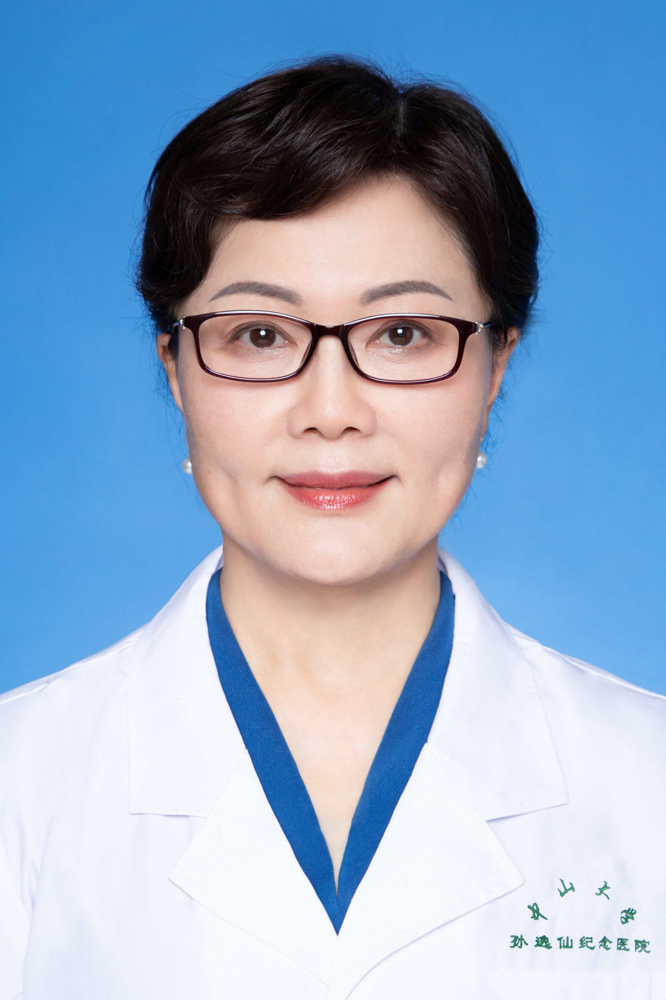

<!-- AUTO-GENERATED-BY: work/generate_obsidian_profiles.py -->

<!-- TEMPLATE: D:\workspace\信息收集整理\医生画像仓库\模板\医生画像模板.md -->

# 杨冬梓

## 基础信息

| 字段 | 内容 |
|---|---|
| 姓名 | 杨冬梓 |
| 医院 | 中山大学孙逸仙纪念医院 |
| 科室 | 妇科生殖内分泌专科 |
| 职称/身份 | 教授, 主任医师 |
| 来源链接 | [官网原文](https://www.gzsys.org.cn/node/15620) |
| 采集日期 | 2026-08-13 |

## 简介/擅长

## 科研项目与成果

- 研究成果多次被国际顶级学术团体的指南共识所引用；

## 可包装亮点

- 杨冬梓，医学博士、教授、博士生导师。
- 现任中山大学孙逸仙纪念医院妇产科生殖专科一级主任医师、二级教授、博导；
- 从事妇产科工作38年，担任中山大学孙逸仙纪念医院妇产科主任、生殖医学专科主任多年。
- 现学术团体任职有中国医师协会生殖医学专业委员会副主委、《中华妇产科杂志》副总编，第五届广东省女医师协会副会长、第一届粤港澳大湾区妇产科医生联盟主委、第二、三届广东省医师协会妇产科医师分会主委等。

## 重点疾病/人群标签

- 慢性病：
- 肿瘤：
- 生殖疾病：生殖、不孕、卵巢、辅助生殖、试管、胚胎、多囊、疑难、复杂
- 免疫/风湿：
- 术后恢复/康复：
- 疑难重症：生殖、不孕、卵巢、辅助生殖、试管、胚胎、多囊、疑难、复杂

## 证据摘录

> 只摘录官网公开信息中的短句或关键字段，不复制大段原文。

- 官网身份字段：教授, 主任医师
- 官网亮眼经历线索：杨冬梓，医学博士、教授、博士生导师。 现任中山大学孙逸仙纪念医院妇产科生殖专科一级主任医师、二级教授、博导； 从事妇产科工作38年，担任中山大学孙逸仙纪念医院妇产科主任、生殖医学专科主任多年。 现学术团体任职有中国医师协会生殖医学专业委员会副主委、《中华妇产科杂志》副总编，第五届广东省女医师协会副会长、第一届粤港澳大湾区妇产科医生联盟主委、第二、三届广东省医师协会妇产科医师分会主委等。
- 来源链接：https://www.gzsys.org.cn/node/15620

## BD 画像摘要

杨冬梓医生可作为生殖疾病、疑难重症方向的基础画像候选。后续 BD 使用应继续以官网来源和人工复核为准，不添加疗效承诺或无来源包装。

## 合规边界

- 仅使用医院官网、官方公众号、官方小程序等公开渠道。
- 不采集私人电话、私人微信、家庭住址、患者隐私或非公开排班信息。
- 不写“保证治愈”“疗效第一”“包治疑难杂症”等无法由官网证明的表述。
